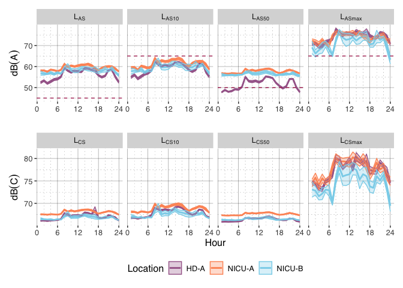
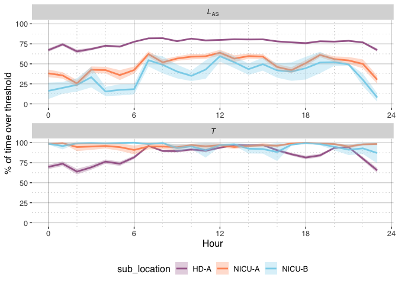

# README
Bhan, Lam

# Replication code for “Do neonates hear what we measure? Assessing neonatal ward soundscapes at the neonates’ ears”

The GitHub repository contains the code to replicate the analysis,
figures and tables for the paper titled: “Do neonates hear what we
measure? Assessing neonatal ward soundscapes at the neonates’ ears”.

The data that support the findings of this study are openly available in
NTU research  
data repository DR-NTU (Data) at <https://doi.org/10.21979/N9/8GHNGX>

The subheadings in this repository follows the headings in the paper
(after the [Data Preparation](#dataprep) section) for consistency.

The following figures and tables are produced by this replication code:

- [`Table 4`](#tab_4) in [3.1. HD ward](#sec3.1)
- [`Figure 3`](#fig_3) in [4.1. A- and C- weighted metrics](#sec4.1)
- [`Table 5`](#tab_5) in [4.2. Acoustic guidelines](#sec4.2)
- [`Figure 4`](#fig_4) in [4.3. Occurence rates](#sec4.3)
- [`Table A.1`](#tab_A.1) in [Appendix A Statistical test
  results](#sec_AppendixA)
- [`Table A.2`](#tab_A.2) in [Appendix A Statistical test
  results](#sec_AppendixA)
- [`Table A.3`](#tab_A.3) in [Appendix A Statistical test
  results](#sec_AppendixA)

## Initialisation

## Data Loading

Download the dataset from Dataverse if it does not exist. Note that this
code repository is configure to ignore the <kbd>data</kbd> folder during
git commits due to the large size (3.4 GB) of the dataset <kbd>csv</kbd>
file.

    [1] "The dataset exists"

Load the “timeSeries1sec.csv” dataset file containing the measurement
data

## Data Preparation

### Adding sub location data due to bed position changes

The bed positions in the wards were shifted according to the schedule
below.

From NICU:

1.  Start to 2022-03-17 11:20: NICU-A
2.  2022-03-17 11:20 to 2022-03-21 12:45: NICU-B
3.  2022-03-21 12:45 onwards: NICU-A

From HD:

1.  Start to 2022-04-03 09:00: HD-A
2.  2022-04-03 09:00 to 2022-04-03 10:00: HD-B
3.  2022-04-03 10:00 onwards: HD-A

Changeover dates to mark out:

1.  start: 20220303 16:00:00 /
2.  change: 20220318 16:00:00 to 17:00:00
3.  change: 20220324 16:00:00 to 17:00:00

``` r
timeseries.dt <- timeseries.dt |>
        #account for transition period of \pm 15 mins
        dplyr::mutate(
                sub_location = case_when(
                        #trim start for both
                        datetime < ymd_hms(
                                "2022-03-03 17:00:00", tz = "Singapore"
                        ) ~ "transition",
                        #NICU-A
                        datetime < ymd_hms(
                                "2022-03-17 11:05:00", tz = "Singapore"
                                ) & location == "NICU" ~ "NICU-A",
                        #30 min gap; NICU-B
                        datetime > ymd_hms(
                                "2022-03-17 11:35:00", tz = "Singapore"
                                ) &
                                datetime < ymd_hms(
                                "2022-03-21 12:45:00", tz = "Singapore"
                                ) & 
                                location == "NICU" ~ "NICU-B",
                        #30 min gap; NICU-A and trim end for nicu
                        datetime > ymd_hms(
                                "2022-03-21 13:15:00", tz = "Singapore"
                                ) & 
                                datetime < ymd_hms(
                                "2022-03-24 21:00:00", tz = "Singapore"
                                ) &
                                location == "NICU" ~ "NICU-A",
                        #HD-A
                        datetime < ymd_hms(
                                "2022-04-03 08:45:00", tz = "Singapore"
                                ) & location == "HD" ~ "HD-A",
                        #30 min gap; HD-B
                        datetime > ymd_hms(
                                "2022-04-03 09:15:00", tz = "Singapore"
                                ) &
                                datetime < ymd_hms(
                                "2022-04-03 09:45:00", tz = "Singapore"
                                ) & location == "HD" ~ "HD-B",
                        #30 min gap: HD-A and trim end for HD
                        datetime > ymd_hms(
                                "2022-04-03 10:15:00", tz = "Singapore"
                                ) & 
                                datetime < ymd_hms(
                                "2022-04-13 15:00:00", tz = "Singapore"
                                ) &
                                location == "HD" ~ "HD-A",
                       .default = "transition"
                )
        ) |>
        dplyr::filter(!sub_location == "transition")
```

### Summarising metrics by time and computation of summary statistics

``` r
#metrics to be summarised
params.art.df <- data.frame(
        aweight=c("L[AS]","L[ASmax]","L[AS10]","L[AS50]","L[AS90]"),
        cweight=c("L[CS]","L[CSmax]","L[CS10]","L[CS50]","L[CS90]"),
        tuhms=c("T","T[max]","T[10]","T[50]","T[90]")
        )

# Function to calculate metrics
calculate_metrics <- function(data, prefix) {
  data |> summarise(
          !!sym(prefix) := if(prefix %in% c("LAS", "LCS")) meandB(score_1min) else mean(score_1min),
          !!sym(paste0(prefix, "max")) := max(score_1min),
          !!sym(paste0(prefix, "10")) := quantile(score_1min, 0.90),
          !!sym(paste0(prefix, "50")) := quantile(score_1min, 0.50),
          !!sym(paste0(prefix, "90")) := quantile(score_1min, 0.10)
    )
}

# Process and combine all metrics
timeseries_1hour_metrics <- timeseries.dt |>
        dplyr::mutate(hour = floor_date(datetime,unit = "hour"))
        
timeseries_1hour_metrics <-
        bind_cols(
                #a-weighted
                timeseries_1hour_metrics |> 
                        dplyr::filter(acoUnit == "dBA") |>
                        group_by(sub_location, microphone, hour) |>
                        group_modify(~ calculate_metrics(., "LAS")) |>
                        ungroup(),
                #c-weighted
                timeseries_1hour_metrics |>
                        dplyr::filter(acoUnit == "dBC") |>
                        group_by(sub_location, microphone, hour) |>
                        group_modify(~ calculate_metrics(., "LCS")) |>
                        ungroup() |>
                        dplyr::select(c("LCS":"LCS90")),
                #tonality
                timeseries_1hour_metrics |>
                        dplyr::filter(acoUnit == "tuHMS") |>
                        group_by(sub_location, microphone, hour) |>
                        group_modify(~ calculate_metrics(., "T")) |>
                        ungroup() |>
                        dplyr::select(c("T":"T90"))
                ) |>
        dplyr::mutate(
                microphone = as.factor(microphone),
                sub_location = as.factor(sub_location),
                `LCS-LAS` = LCS - LAS,
                `LAS10-LAS90` = LAS10 - LAS90,
                location = ifelse(
                        grepl("NICU",sub_location),
                        "NICU",
                        "HD"
                        ), .before="sub_location"
                )
```

### Adding weeks for plotting

``` r
# add week number for plotting
firstHour<-min(timeseries_1hour_metrics$hour)
timeseries_1hour_metrics_wk <- timeseries_1hour_metrics |> 
        dplyr::mutate(
        week=case_when(
                difftime(hour, firstHour, units="days")<=7 ~ "Week 1",
                difftime(hour, firstHour, units="days")<=14 ~ "Week 2",
                difftime(hour, firstHour, units="days")<=21 ~ "Week 3",
                difftime(hour, firstHour, units="days")<=28 ~ "Week 4",
                difftime(hour, firstHour, units="days")<=35 ~ "Week 5",
                difftime(hour, firstHour, units="days")<=42 ~ "Week 6"
                )) |>
        group_by(location,microphone) |>
        arrange(hour) |>
        ungroup()

# convert to dataframe to long form
timeseries_1hour_metrics_wk_long <- timeseries_1hour_metrics_wk |>
        dplyr::filter(microphone %in% c("binL","binR")) |>
        pivot_longer(cols = c(LAS:T90,`LCS-LAS`,`LAS10-LAS90`),
                     names_to = "acoUnit_stat",
                     values_to = "score") |>
        pivot_wider(
                names_from = microphone,
                values_from = score
        ) |>
        #find binaural average
        dplyr::mutate(
                bin_LR = ifelse(
                        grepl("^L", acoUnit_stat),
                        10*log10((10^(binL/10)+10^(binR/10))/2),
                        (binL+binR)/2
                        ),
                hour=factor(hour(hour), levels=c(0:23))
                ) 
```

### Subsetting data before microphones were shifted

``` r
#1hour aggregated dBA metrics for both locations
timeseries_1hour_metrics_fixed <- timeseries_1hour_metrics |>
        dplyr::filter(
                hour >= ymd_hms("20220303 17:00:00", tz ="Singapore") & 
                        hour <= ymd_hms("20220317 10:30:00", 
                                          tz ="Singapore")
                ) |>
        dplyr::mutate(
                location = as.factor(location)
        )
```

## 3. Acoustic variation between microphone position

### 3.1 HD ward

#### `Table 4`: Mean and standard deviation of the differences in 1-h slow time-weighted metrics at the HD-A and NICU-A bed positions measured from 03/03/2022 17:00:00 to 17/03/2022 10:30:00. Difference pairs with significant ART contrasts are indicated in bold.

``` r
#compute differences separately for each location due to the different 
#number of microphones

#hd
diff.summary.1h.hd <- timeseries_1hour_metrics_fixed |>
        dplyr::select(!c(LAS90,LCS90:T90)) |>
        dplyr::filter(location=="HD") |>
        pivot_longer(
                names_to = "acoUnit",
                values_to = "score",
                cols = c(
                        LAS,LAS10,LAS50,LASmax,
                        LCS,LCS10,LCS50,LCSmax,
                        `LCS-LAS`,`LAS10-LAS90`)
                ) |>
        pivot_wider(names_from = microphone, values_from = score) |>
        # mutate(`binL-binR`=abs(binL-binR),
        #        `binL-146AE`=abs(binL-`146AE`),
        #        `binR-146AE`=abs(binR-`146AE`)) %>%
        mutate(`binL-binR`=binL-binR,
               `binL-146AE`=binL-`146AE`,
               `binR-146AE`=binR-`146AE`) |>
        pivot_longer(names_to = "microphone",
                     values_to = "score",
                     cols = c(`146AE`:`binR-146AE`)) |>
        #summary by acounit and microphone
        dplyr::group_by(microphone,acoUnit) |>
        summarise(
                mean=round(mean(score),3),
                sd=sd(score),
                score=list(score)
                ) |>
        dplyr::mutate(location="HD",.before = microphone)

#nicu
diff.summary.1h.nicu <- timeseries_1hour_metrics_fixed |> 
        dplyr::filter(location=="NICU") |>
        dplyr::select(!c(LAS90,LCS90:T90)) |>
        pivot_longer(
                names_to = "acoUnit",
                values_to = "score",
                cols = c(
                        LAS,LAS10,LAS50,LASmax,
                        LCS,LCS10,LCS50,LCSmax,
                        `LCS-LAS`,`LAS10-LAS90`)
                ) |>
        pivot_wider(names_from = microphone, values_from = score) |>
        mutate(
                `binL-binR`=binL-binR,
                `binL-146AEIn`=binL-`146AEIn`,
                `binL-146AEOut`=binL-`146AEOut`,
                `binR-146AEIn`=binR-`146AEIn`,
                `binR-146AEOut`=binR-`146AEOut`,
                `146AEIn-146AEOut`=`146AEIn`-`146AEOut`
               ) |>
        pivot_longer(
                names_to = "microphone",
                values_to = "score",
                cols = c(`146AEIn`:`146AEIn-146AEOut`)
                ) |>
        #summary by acounit and microphone
        dplyr::group_by(microphone,acoUnit) |>
        summarise(mean=round(mean(score),3),
                  sd=sd(score),
                  score=list(score)) |>
        dplyr::mutate(location="NICU",.before = microphone)

# Define a function to apply md() to each column label
md_label <- function(label) {
  md(label)
}

#plot table of differences across all locations
gt.diff.summary.1h <- rbind(diff.summary.1h.hd,diff.summary.1h.nicu) |>
        dplyr::filter(!microphone %in% c("146AE","binL","binR",
                                         "146AEIn","146AEOut")) |>
        dplyr::mutate(mean_sd=paste0(formatC(mean,
                                             format = "f",
                                             digits = 2),
                                     " (", 
                                     formatC(sd,
                                             format = "f",
                                             digits = 2), 
                                     ")")) |>
        pivot_wider(
                id_cols = acoUnit,
                names_from = c(location,microphone),
                values_from = mean_sd
        ) |>
        gt::gt() |>
        tab_spanner(
                label = "HD",
                columns = starts_with("HD")
                ) |>
        tab_spanner(
                label = "NICU",
                columns = starts_with("NICU")
                ) |>
        cols_label_with(
                fn = ~ gsub("HD_|NICU_","", .)
        ) |>
        cols_label_with(
                fn = ~ gsub("146AE ","mout ",.)
        ) |>
        cols_label_with(
                fn = ~ gsub("bin|146AE","m",.)
        ) |>
        cols_label_with(
                fn = ~ gsub("(In|Out)", "\\L\\1", ., perl = TRUE)
        ) |>
        cols_label_with(
                fn = ~ gsub("(R|L|out|in)", "<sub>\\1</sub>", .,
                            perl = TRUE)
        ) |> 
        cols_label_with (
                fn = ~ md_label(.)
        )

gt.diff.summary.1h |> gtsave(filename = "diff_1h_meansd.tex",
                             path = "output/")

gt.diff.summary.1h
```

<div id="zjffqdidbv" style="padding-left:0px;padding-right:0px;padding-top:10px;padding-bottom:10px;overflow-x:auto;overflow-y:auto;width:auto;height:auto;">
<style>#zjffqdidbv table {
  font-family: system-ui, 'Segoe UI', Roboto, Helvetica, Arial, sans-serif, 'Apple Color Emoji', 'Segoe UI Emoji', 'Segoe UI Symbol', 'Noto Color Emoji';
  -webkit-font-smoothing: antialiased;
  -moz-osx-font-smoothing: grayscale;
}
&#10;#zjffqdidbv thead, #zjffqdidbv tbody, #zjffqdidbv tfoot, #zjffqdidbv tr, #zjffqdidbv td, #zjffqdidbv th {
  border-style: none;
}
&#10;#zjffqdidbv p {
  margin: 0;
  padding: 0;
}
&#10;#zjffqdidbv .gt_table {
  display: table;
  border-collapse: collapse;
  line-height: normal;
  margin-left: auto;
  margin-right: auto;
  color: #333333;
  font-size: 16px;
  font-weight: normal;
  font-style: normal;
  background-color: #FFFFFF;
  width: auto;
  border-top-style: solid;
  border-top-width: 2px;
  border-top-color: #A8A8A8;
  border-right-style: none;
  border-right-width: 2px;
  border-right-color: #D3D3D3;
  border-bottom-style: solid;
  border-bottom-width: 2px;
  border-bottom-color: #A8A8A8;
  border-left-style: none;
  border-left-width: 2px;
  border-left-color: #D3D3D3;
}
&#10;#zjffqdidbv .gt_caption {
  padding-top: 4px;
  padding-bottom: 4px;
}
&#10;#zjffqdidbv .gt_title {
  color: #333333;
  font-size: 125%;
  font-weight: initial;
  padding-top: 4px;
  padding-bottom: 4px;
  padding-left: 5px;
  padding-right: 5px;
  border-bottom-color: #FFFFFF;
  border-bottom-width: 0;
}
&#10;#zjffqdidbv .gt_subtitle {
  color: #333333;
  font-size: 85%;
  font-weight: initial;
  padding-top: 3px;
  padding-bottom: 5px;
  padding-left: 5px;
  padding-right: 5px;
  border-top-color: #FFFFFF;
  border-top-width: 0;
}
&#10;#zjffqdidbv .gt_heading {
  background-color: #FFFFFF;
  text-align: center;
  border-bottom-color: #FFFFFF;
  border-left-style: none;
  border-left-width: 1px;
  border-left-color: #D3D3D3;
  border-right-style: none;
  border-right-width: 1px;
  border-right-color: #D3D3D3;
}
&#10;#zjffqdidbv .gt_bottom_border {
  border-bottom-style: solid;
  border-bottom-width: 2px;
  border-bottom-color: #D3D3D3;
}
&#10;#zjffqdidbv .gt_col_headings {
  border-top-style: solid;
  border-top-width: 2px;
  border-top-color: #D3D3D3;
  border-bottom-style: solid;
  border-bottom-width: 2px;
  border-bottom-color: #D3D3D3;
  border-left-style: none;
  border-left-width: 1px;
  border-left-color: #D3D3D3;
  border-right-style: none;
  border-right-width: 1px;
  border-right-color: #D3D3D3;
}
&#10;#zjffqdidbv .gt_col_heading {
  color: #333333;
  background-color: #FFFFFF;
  font-size: 100%;
  font-weight: normal;
  text-transform: inherit;
  border-left-style: none;
  border-left-width: 1px;
  border-left-color: #D3D3D3;
  border-right-style: none;
  border-right-width: 1px;
  border-right-color: #D3D3D3;
  vertical-align: bottom;
  padding-top: 5px;
  padding-bottom: 6px;
  padding-left: 5px;
  padding-right: 5px;
  overflow-x: hidden;
}
&#10;#zjffqdidbv .gt_column_spanner_outer {
  color: #333333;
  background-color: #FFFFFF;
  font-size: 100%;
  font-weight: normal;
  text-transform: inherit;
  padding-top: 0;
  padding-bottom: 0;
  padding-left: 4px;
  padding-right: 4px;
}
&#10;#zjffqdidbv .gt_column_spanner_outer:first-child {
  padding-left: 0;
}
&#10;#zjffqdidbv .gt_column_spanner_outer:last-child {
  padding-right: 0;
}
&#10;#zjffqdidbv .gt_column_spanner {
  border-bottom-style: solid;
  border-bottom-width: 2px;
  border-bottom-color: #D3D3D3;
  vertical-align: bottom;
  padding-top: 5px;
  padding-bottom: 5px;
  overflow-x: hidden;
  display: inline-block;
  width: 100%;
}
&#10;#zjffqdidbv .gt_spanner_row {
  border-bottom-style: hidden;
}
&#10;#zjffqdidbv .gt_group_heading {
  padding-top: 8px;
  padding-bottom: 8px;
  padding-left: 5px;
  padding-right: 5px;
  color: #333333;
  background-color: #FFFFFF;
  font-size: 100%;
  font-weight: initial;
  text-transform: inherit;
  border-top-style: solid;
  border-top-width: 2px;
  border-top-color: #D3D3D3;
  border-bottom-style: solid;
  border-bottom-width: 2px;
  border-bottom-color: #D3D3D3;
  border-left-style: none;
  border-left-width: 1px;
  border-left-color: #D3D3D3;
  border-right-style: none;
  border-right-width: 1px;
  border-right-color: #D3D3D3;
  vertical-align: middle;
  text-align: left;
}
&#10;#zjffqdidbv .gt_empty_group_heading {
  padding: 0.5px;
  color: #333333;
  background-color: #FFFFFF;
  font-size: 100%;
  font-weight: initial;
  border-top-style: solid;
  border-top-width: 2px;
  border-top-color: #D3D3D3;
  border-bottom-style: solid;
  border-bottom-width: 2px;
  border-bottom-color: #D3D3D3;
  vertical-align: middle;
}
&#10;#zjffqdidbv .gt_from_md > :first-child {
  margin-top: 0;
}
&#10;#zjffqdidbv .gt_from_md > :last-child {
  margin-bottom: 0;
}
&#10;#zjffqdidbv .gt_row {
  padding-top: 8px;
  padding-bottom: 8px;
  padding-left: 5px;
  padding-right: 5px;
  margin: 10px;
  border-top-style: solid;
  border-top-width: 1px;
  border-top-color: #D3D3D3;
  border-left-style: none;
  border-left-width: 1px;
  border-left-color: #D3D3D3;
  border-right-style: none;
  border-right-width: 1px;
  border-right-color: #D3D3D3;
  vertical-align: middle;
  overflow-x: hidden;
}
&#10;#zjffqdidbv .gt_stub {
  color: #333333;
  background-color: #FFFFFF;
  font-size: 100%;
  font-weight: initial;
  text-transform: inherit;
  border-right-style: solid;
  border-right-width: 2px;
  border-right-color: #D3D3D3;
  padding-left: 5px;
  padding-right: 5px;
}
&#10;#zjffqdidbv .gt_stub_row_group {
  color: #333333;
  background-color: #FFFFFF;
  font-size: 100%;
  font-weight: initial;
  text-transform: inherit;
  border-right-style: solid;
  border-right-width: 2px;
  border-right-color: #D3D3D3;
  padding-left: 5px;
  padding-right: 5px;
  vertical-align: top;
}
&#10;#zjffqdidbv .gt_row_group_first td {
  border-top-width: 2px;
}
&#10;#zjffqdidbv .gt_row_group_first th {
  border-top-width: 2px;
}
&#10;#zjffqdidbv .gt_summary_row {
  color: #333333;
  background-color: #FFFFFF;
  text-transform: inherit;
  padding-top: 8px;
  padding-bottom: 8px;
  padding-left: 5px;
  padding-right: 5px;
}
&#10;#zjffqdidbv .gt_first_summary_row {
  border-top-style: solid;
  border-top-color: #D3D3D3;
}
&#10;#zjffqdidbv .gt_first_summary_row.thick {
  border-top-width: 2px;
}
&#10;#zjffqdidbv .gt_last_summary_row {
  padding-top: 8px;
  padding-bottom: 8px;
  padding-left: 5px;
  padding-right: 5px;
  border-bottom-style: solid;
  border-bottom-width: 2px;
  border-bottom-color: #D3D3D3;
}
&#10;#zjffqdidbv .gt_grand_summary_row {
  color: #333333;
  background-color: #FFFFFF;
  text-transform: inherit;
  padding-top: 8px;
  padding-bottom: 8px;
  padding-left: 5px;
  padding-right: 5px;
}
&#10;#zjffqdidbv .gt_first_grand_summary_row {
  padding-top: 8px;
  padding-bottom: 8px;
  padding-left: 5px;
  padding-right: 5px;
  border-top-style: double;
  border-top-width: 6px;
  border-top-color: #D3D3D3;
}
&#10;#zjffqdidbv .gt_last_grand_summary_row_top {
  padding-top: 8px;
  padding-bottom: 8px;
  padding-left: 5px;
  padding-right: 5px;
  border-bottom-style: double;
  border-bottom-width: 6px;
  border-bottom-color: #D3D3D3;
}
&#10;#zjffqdidbv .gt_striped {
  background-color: rgba(128, 128, 128, 0.05);
}
&#10;#zjffqdidbv .gt_table_body {
  border-top-style: solid;
  border-top-width: 2px;
  border-top-color: #D3D3D3;
  border-bottom-style: solid;
  border-bottom-width: 2px;
  border-bottom-color: #D3D3D3;
}
&#10;#zjffqdidbv .gt_footnotes {
  color: #333333;
  background-color: #FFFFFF;
  border-bottom-style: none;
  border-bottom-width: 2px;
  border-bottom-color: #D3D3D3;
  border-left-style: none;
  border-left-width: 2px;
  border-left-color: #D3D3D3;
  border-right-style: none;
  border-right-width: 2px;
  border-right-color: #D3D3D3;
}
&#10;#zjffqdidbv .gt_footnote {
  margin: 0px;
  font-size: 90%;
  padding-top: 4px;
  padding-bottom: 4px;
  padding-left: 5px;
  padding-right: 5px;
}
&#10;#zjffqdidbv .gt_sourcenotes {
  color: #333333;
  background-color: #FFFFFF;
  border-bottom-style: none;
  border-bottom-width: 2px;
  border-bottom-color: #D3D3D3;
  border-left-style: none;
  border-left-width: 2px;
  border-left-color: #D3D3D3;
  border-right-style: none;
  border-right-width: 2px;
  border-right-color: #D3D3D3;
}
&#10;#zjffqdidbv .gt_sourcenote {
  font-size: 90%;
  padding-top: 4px;
  padding-bottom: 4px;
  padding-left: 5px;
  padding-right: 5px;
}
&#10;#zjffqdidbv .gt_left {
  text-align: left;
}
&#10;#zjffqdidbv .gt_center {
  text-align: center;
}
&#10;#zjffqdidbv .gt_right {
  text-align: right;
  font-variant-numeric: tabular-nums;
}
&#10;#zjffqdidbv .gt_font_normal {
  font-weight: normal;
}
&#10;#zjffqdidbv .gt_font_bold {
  font-weight: bold;
}
&#10;#zjffqdidbv .gt_font_italic {
  font-style: italic;
}
&#10;#zjffqdidbv .gt_super {
  font-size: 65%;
}
&#10;#zjffqdidbv .gt_footnote_marks {
  font-size: 75%;
  vertical-align: 0.4em;
  position: initial;
}
&#10;#zjffqdidbv .gt_asterisk {
  font-size: 100%;
  vertical-align: 0;
}
&#10;#zjffqdidbv .gt_indent_1 {
  text-indent: 5px;
}
&#10;#zjffqdidbv .gt_indent_2 {
  text-indent: 10px;
}
&#10;#zjffqdidbv .gt_indent_3 {
  text-indent: 15px;
}
&#10;#zjffqdidbv .gt_indent_4 {
  text-indent: 20px;
}
&#10;#zjffqdidbv .gt_indent_5 {
  text-indent: 25px;
}
&#10;#zjffqdidbv .katex-display {
  display: inline-flex !important;
  margin-bottom: 0.75em !important;
}
&#10;#zjffqdidbv div.Reactable > div.rt-table > div.rt-thead > div.rt-tr.rt-tr-group-header > div.rt-th-group:after {
  height: 0px !important;
}
</style>

<table class="gt_table" style="width:100%;"
data-quarto-postprocess="true" data-quarto-disable-processing="false"
data-quarto-bootstrap="false">
<colgroup>
<col style="width: 10%" />
<col style="width: 10%" />
<col style="width: 10%" />
<col style="width: 10%" />
<col style="width: 10%" />
<col style="width: 10%" />
<col style="width: 10%" />
<col style="width: 10%" />
<col style="width: 10%" />
<col style="width: 10%" />
</colgroup>
<thead>
<tr class="header gt_col_headings gt_spanner_row">
<th rowspan="2" id="acoUnit"
class="gt_col_heading gt_columns_bottom_border gt_left"
data-quarto-table-cell-role="th" scope="col">acoUnit</th>
<th colspan="3" id="HD"
class="gt_center gt_columns_top_border gt_column_spanner_outer"
data-quarto-table-cell-role="th" scope="colgroup"><div
class="gt_column_spanner">
HD
</div></th>
<th colspan="6" id="NICU"
class="gt_center gt_columns_top_border gt_column_spanner_outer"
data-quarto-table-cell-role="th" scope="colgroup"><div
class="gt_column_spanner">
NICU
</div></th>
</tr>
<tr class="odd gt_col_headings">
<th id="HD_binL-146AE"
class="gt_col_heading gt_columns_bottom_border gt_right"
data-quarto-table-cell-role="th" scope="col">m<sub>L</sub>-m</th>
<th id="HD_binL-binR"
class="gt_col_heading gt_columns_bottom_border gt_right"
data-quarto-table-cell-role="th"
scope="col">m<sub>L</sub>-m<sub>R</sub></th>
<th id="HD_binR-146AE"
class="gt_col_heading gt_columns_bottom_border gt_right"
data-quarto-table-cell-role="th" scope="col">m<sub>R</sub>-m</th>
<th id="NICU_146AEIn-146AEOut"
class="gt_col_heading gt_columns_bottom_border gt_right"
data-quarto-table-cell-role="th"
scope="col">m<sub>in</sub>-m<sub>out</sub></th>
<th id="NICU_binL-146AEIn"
class="gt_col_heading gt_columns_bottom_border gt_right"
data-quarto-table-cell-role="th"
scope="col">m<sub>L</sub>-m<sub>in</sub></th>
<th id="NICU_binL-146AEOut"
class="gt_col_heading gt_columns_bottom_border gt_right"
data-quarto-table-cell-role="th"
scope="col">m<sub>L</sub>-m<sub>out</sub></th>
<th id="NICU_binL-binR"
class="gt_col_heading gt_columns_bottom_border gt_right"
data-quarto-table-cell-role="th"
scope="col">m<sub>L</sub>-m<sub>R</sub></th>
<th id="NICU_binR-146AEIn"
class="gt_col_heading gt_columns_bottom_border gt_right"
data-quarto-table-cell-role="th"
scope="col">m<sub>R</sub>-m<sub>in</sub></th>
<th id="NICU_binR-146AEOut"
class="gt_col_heading gt_columns_bottom_border gt_right"
data-quarto-table-cell-role="th"
scope="col">m<sub>R</sub>-m<sub>out</sub></th>
</tr>
</thead>
<tbody class="gt_table_body">
<tr class="odd">
<td class="gt_row gt_left" headers="acoUnit">LAS</td>
<td class="gt_row gt_right" headers="HD_binL-146AE">-1.35 (1.18)</td>
<td class="gt_row gt_right" headers="HD_binL-binR">-0.07 (0.82)</td>
<td class="gt_row gt_right" headers="HD_binR-146AE">-1.27 (0.79)</td>
<td class="gt_row gt_right" headers="NICU_146AEIn-146AEOut">-0.38
(0.40)</td>
<td class="gt_row gt_right" headers="NICU_binL-146AEIn">3.02 (0.54)</td>
<td class="gt_row gt_right" headers="NICU_binL-146AEOut">2.64
(0.50)</td>
<td class="gt_row gt_right" headers="NICU_binL-binR">0.04 (0.55)</td>
<td class="gt_row gt_right" headers="NICU_binR-146AEIn">2.98 (0.38)</td>
<td class="gt_row gt_right" headers="NICU_binR-146AEOut">2.60
(0.51)</td>
</tr>
<tr class="even">
<td class="gt_row gt_left" headers="acoUnit">LAS10</td>
<td class="gt_row gt_right" headers="HD_binL-146AE">-1.62 (0.97)</td>
<td class="gt_row gt_right" headers="HD_binL-binR">-0.17 (0.50)</td>
<td class="gt_row gt_right" headers="HD_binR-146AE">-1.45 (0.87)</td>
<td class="gt_row gt_right" headers="NICU_146AEIn-146AEOut">-0.47
(0.46)</td>
<td class="gt_row gt_right" headers="NICU_binL-146AEIn">2.90 (0.56)</td>
<td class="gt_row gt_right" headers="NICU_binL-146AEOut">2.44
(0.54)</td>
<td class="gt_row gt_right" headers="NICU_binL-binR">-0.00 (0.65)</td>
<td class="gt_row gt_right" headers="NICU_binR-146AEIn">2.91 (0.46)</td>
<td class="gt_row gt_right" headers="NICU_binR-146AEOut">2.44
(0.61)</td>
</tr>
<tr class="odd">
<td class="gt_row gt_left" headers="acoUnit">LAS10-LAS90</td>
<td class="gt_row gt_right" headers="HD_binL-146AE">-0.76 (0.77)</td>
<td class="gt_row gt_right" headers="HD_binL-binR">-0.03 (0.51)</td>
<td class="gt_row gt_right" headers="HD_binR-146AE">-0.73 (0.69)</td>
<td class="gt_row gt_right" headers="NICU_146AEIn-146AEOut">-0.18
(0.44)</td>
<td class="gt_row gt_right" headers="NICU_binL-146AEIn">-0.35
(0.47)</td>
<td class="gt_row gt_right" headers="NICU_binL-146AEOut">-0.52
(0.44)</td>
<td class="gt_row gt_right" headers="NICU_binL-binR">-0.11 (0.64)</td>
<td class="gt_row gt_right" headers="NICU_binR-146AEIn">-0.23
(0.53)</td>
<td class="gt_row gt_right" headers="NICU_binR-146AEOut">-0.41
(0.63)</td>
</tr>
<tr class="even">
<td class="gt_row gt_left" headers="acoUnit">LAS50</td>
<td class="gt_row gt_right" headers="HD_binL-146AE">-1.24 (0.71)</td>
<td class="gt_row gt_right" headers="HD_binL-binR">-0.20 (0.24)</td>
<td class="gt_row gt_right" headers="HD_binR-146AE">-1.04 (0.66)</td>
<td class="gt_row gt_right" headers="NICU_146AEIn-146AEOut">-0.36
(0.42)</td>
<td class="gt_row gt_right" headers="NICU_binL-146AEIn">3.29 (0.58)</td>
<td class="gt_row gt_right" headers="NICU_binL-146AEOut">2.93
(0.57)</td>
<td class="gt_row gt_right" headers="NICU_binL-binR">0.11 (0.70)</td>
<td class="gt_row gt_right" headers="NICU_binR-146AEIn">3.17 (0.43)</td>
<td class="gt_row gt_right" headers="NICU_binR-146AEOut">2.81
(0.56)</td>
</tr>
<tr class="odd">
<td class="gt_row gt_left" headers="acoUnit">LASmax</td>
<td class="gt_row gt_right" headers="HD_binL-146AE">-1.27 (2.77)</td>
<td class="gt_row gt_right" headers="HD_binL-binR">0.04 (2.13)</td>
<td class="gt_row gt_right" headers="HD_binR-146AE">-1.31 (1.83)</td>
<td class="gt_row gt_right" headers="NICU_146AEIn-146AEOut">-0.60
(1.20)</td>
<td class="gt_row gt_right" headers="NICU_binL-146AEIn">3.04 (1.62)</td>
<td class="gt_row gt_right" headers="NICU_binL-146AEOut">2.44
(1.61)</td>
<td class="gt_row gt_right" headers="NICU_binL-binR">0.55 (1.46)</td>
<td class="gt_row gt_right" headers="NICU_binR-146AEIn">2.49 (1.39)</td>
<td class="gt_row gt_right" headers="NICU_binR-146AEOut">1.89
(1.61)</td>
</tr>
<tr class="even">
<td class="gt_row gt_left" headers="acoUnit">LCS</td>
<td class="gt_row gt_right" headers="HD_binL-146AE">-0.29 (0.64)</td>
<td class="gt_row gt_right" headers="HD_binL-binR">-0.96 (0.55)</td>
<td class="gt_row gt_right" headers="HD_binR-146AE">0.67 (0.36)</td>
<td class="gt_row gt_right" headers="NICU_146AEIn-146AEOut">-0.35
(0.07)</td>
<td class="gt_row gt_right" headers="NICU_binL-146AEIn">1.09 (0.19)</td>
<td class="gt_row gt_right" headers="NICU_binL-146AEOut">0.73
(0.20)</td>
<td class="gt_row gt_right" headers="NICU_binL-binR">0.48 (0.16)</td>
<td class="gt_row gt_right" headers="NICU_binR-146AEIn">0.60 (0.25)</td>
<td class="gt_row gt_right" headers="NICU_binR-146AEOut">0.25
(0.27)</td>
</tr>
<tr class="odd">
<td class="gt_row gt_left" headers="acoUnit">LCS-LAS</td>
<td class="gt_row gt_right" headers="HD_binL-146AE">1.05 (0.78)</td>
<td class="gt_row gt_right" headers="HD_binL-binR">-0.89 (0.43)</td>
<td class="gt_row gt_right" headers="HD_binR-146AE">1.94 (0.65)</td>
<td class="gt_row gt_right" headers="NICU_146AEIn-146AEOut">0.03
(0.35)</td>
<td class="gt_row gt_right" headers="NICU_binL-146AEIn">-1.93
(0.53)</td>
<td class="gt_row gt_right" headers="NICU_binL-146AEOut">-1.90
(0.55)</td>
<td class="gt_row gt_right" headers="NICU_binL-binR">0.44 (0.42)</td>
<td class="gt_row gt_right" headers="NICU_binR-146AEIn">-2.37
(0.45)</td>
<td class="gt_row gt_right" headers="NICU_binR-146AEOut">-2.35
(0.57)</td>
</tr>
<tr class="even">
<td class="gt_row gt_left" headers="acoUnit">LCS10</td>
<td class="gt_row gt_right" headers="HD_binL-146AE">-0.52 (0.44)</td>
<td class="gt_row gt_right" headers="HD_binL-binR">-0.92 (0.16)</td>
<td class="gt_row gt_right" headers="HD_binR-146AE">0.40 (0.54)</td>
<td class="gt_row gt_right" headers="NICU_146AEIn-146AEOut">-0.33
(0.11)</td>
<td class="gt_row gt_right" headers="NICU_binL-146AEIn">1.28 (0.35)</td>
<td class="gt_row gt_right" headers="NICU_binL-146AEOut">0.95
(0.38)</td>
<td class="gt_row gt_right" headers="NICU_binL-binR">0.41 (0.24)</td>
<td class="gt_row gt_right" headers="NICU_binR-146AEIn">0.87 (0.46)</td>
<td class="gt_row gt_right" headers="NICU_binR-146AEOut">0.54
(0.50)</td>
</tr>
<tr class="odd">
<td class="gt_row gt_left" headers="acoUnit">LCS50</td>
<td class="gt_row gt_right" headers="HD_binL-146AE">-0.16 (0.16)</td>
<td class="gt_row gt_right" headers="HD_binL-binR">-1.08 (0.06)</td>
<td class="gt_row gt_right" headers="HD_binR-146AE">0.92 (0.19)</td>
<td class="gt_row gt_right" headers="NICU_146AEIn-146AEOut">-0.36
(0.06)</td>
<td class="gt_row gt_right" headers="NICU_binL-146AEIn">0.94 (0.13)</td>
<td class="gt_row gt_right" headers="NICU_binL-146AEOut">0.57
(0.14)</td>
<td class="gt_row gt_right" headers="NICU_binL-binR">0.54 (0.15)</td>
<td class="gt_row gt_right" headers="NICU_binR-146AEIn">0.40 (0.17)</td>
<td class="gt_row gt_right" headers="NICU_binR-146AEOut">0.04
(0.19)</td>
</tr>
<tr class="even">
<td class="gt_row gt_left" headers="acoUnit">LCSmax</td>
<td class="gt_row gt_right" headers="HD_binL-146AE">-1.16 (2.94)</td>
<td class="gt_row gt_right" headers="HD_binL-binR">-0.28 (1.76)</td>
<td class="gt_row gt_right" headers="HD_binR-146AE">-0.88 (1.93)</td>
<td class="gt_row gt_right" headers="NICU_146AEIn-146AEOut">-0.39
(0.79)</td>
<td class="gt_row gt_right" headers="NICU_binL-146AEIn">2.19 (0.84)</td>
<td class="gt_row gt_right" headers="NICU_binL-146AEOut">1.81
(0.98)</td>
<td class="gt_row gt_right" headers="NICU_binL-binR">0.31 (0.71)</td>
<td class="gt_row gt_right" headers="NICU_binR-146AEIn">1.88 (0.87)</td>
<td class="gt_row gt_right" headers="NICU_binR-146AEOut">1.49
(1.14)</td>
</tr>
</tbody>
</table>

</div>

## 4. Acoustic variation within-between wards

### 4.1 A- and C-weighted metrics

#### `Figure 3`: A- and C-weighted decibel metrics averaged by hour of the day across the entire measurement duration at NICU-A, NICU-B and HD-A measurement points.

``` r
# define labels for metrics
acoUnit_stat_labs <- c("L[AS]","L[ASmax]","L[AS10]","L[AS50]","L[AS90]",
                       "L[CS]","L[CSmax]","L[CS10]","L[CS50]","L[CS90]",
                       "T","T[max]","T[10]","T[50]","T[90]",
                       "L[CS]-L[AS]","L[AS10]-L[AS90]")
names(acoUnit_stat_labs) <- unique(timeseries_1hour_metrics_wk_long$acoUnit_stat)

# define plot customisation parameters
acoUnit.plotlist<-list()
acoMetric.units<-c("dB(A)","dB(C)","tu[HMS]")
ylim.list<-list(c(65,85),
             c(65,85),
             c(0,2.5))

acoMetric_list<-c("LA","LC","T")

# generate plot
idx<-0
for (acoMetric in acoMetric_list) {
        idx<-idx+1
        acoUnit.plotlist[[idx]] <- ggplot(
                data = timeseries_1hour_metrics_wk_long |>
                        dplyr::filter(
                                grepl(paste0("^",acoMetric), acoUnit_stat) &
                                        !acoUnit_stat %in% 
                                        c(
                                                "LCS-LAS",
                                                "LAS10-LAS90",
                                                "LAS90","LCS90","T90"
                                                ) &
                                        !sub_location == "HD-B"
                                ),
                aes(
                        x = as.numeric(hour),
                        y = bin_LR,
                        color = sub_location,
                        fill = sub_location),
                ) +
                stat_summary(
                        fun = mean,
                        geom = "line",
                        linewidth = 1
                        ) +
                stat_summary(
                        fun = mean,
                        geom = "ribbon",
                        alpha = .3,
                        #fill = "#EB5286",
                        fun.max = function(x) mean(x) + sd(x) / sqrt(length(x)),
                        fun.min = function(x) mean(x) - sd(x) / sqrt(length(x))
                        ) +
                scale_color_paletteer_d("Redmonder::qPBI", direction = -1,
                                        name = "Location"
                                       ) +
                scale_fill_paletteer_d("Redmonder::qPBI", direction = -1,
                                       name = "Location"
                                       ) +
                facet_wrap(
                        ~acoUnit_stat, ncol = 6,
                        labeller = labeller(
                        #acoUnit=acoUnit.labs,
                        acoUnit_stat=as_labeller(
                                acoUnit_stat_labs,label_parsed))) +
                ggthemes::theme_hc() + 
                scale_x_continuous(
                        breaks = seq(0, 24, by = 6),
                        minor_breaks = seq(0, 24, 2)
                     ) +
                theme(panel.grid.minor.y = element_line(color = 1,
                                          size = 0.1,
                                          linetype = 3)) +
                theme(panel.grid.major.x = element_line(color = 1,
                                          size = 0.1,
                                          linetype = 1)) +
                theme(panel.grid.minor.x = element_line(color = 1,
                                          size = 0.1,
                                          linetype = 3)) +
                #xlim(0,23) +
                #ylim(ylim.list[[idx]])+
                xlab("Hour") + 
                labs(
                        y=parse(text = acoMetric.units[idx])
                ) 
        
        
        if (acoMetric == "LA" ) {
                acoUnit.plotlist[[idx]] <- acoUnit.plotlist[[idx]] + 
                        #65 dB limit for LAS10, CC 9th ed
                        geom_hline(
                                data =  data.frame(yint=65, acoUnit_stat = "LAS10"),
                                aes(yintercept = yint),
                                color = "maroon",
                                linetype = "dashed"
                                ) +
                        #50 dB limit for LAS50, CC 9th ed
                        geom_hline(
                                data =  data.frame(yint=50, acoUnit_stat = "LAS50"),
                                aes(yintercept = yint),
                                color = "maroon",
                                linetype = "dashed"
                                ) +
                        #45 dB limit for LAS, 8th ed
                        geom_hline(
                                data =  data.frame(yint=45, acoUnit_stat = "LAS"),
                                aes(yintercept = yint),
                                color = "maroon",
                                linetype = "dashed"
                                ) +
                        #65 dB limit for LASmax, 8th ed
                        geom_hline(
                                data =  data.frame(yint=65, acoUnit_stat = "LASmax"),
                                aes(yintercept = yint),
                                color = "maroon",
                                linetype = "dashed"
                                )
        }
}        

#Combine plot
p.all <- (acoUnit.plotlist[[1]] + 
                theme(legend.position = "none") +
                xlab("")) / 
        # (acoUnit.plotlist[[2]] + theme(legend.position = "none")  +
        #         xlab("")) / 
        acoUnit.plotlist[[2]]

#display plot
p.all
```



``` r
#save plot
ggsave(path = "output/",
       plot = p.all,
       filename = "fig3_acmetrics_24h.pdf",
       device = "pdf",
       units = "px",
       width = 1600,
       height = 1500,
       scale = 3.5,
       dpi = 600) 
```

### 4.2 Acoustic guidelines

#### `Table 5:` Summary of mean A-weighted metrics and percentage of time where the metrics were within  guidelines over $N=981$, $N=392$, and $N=98$ 1-h periods at HD-A, NICU-A and NICU-B bed positions, respectively.

``` r
timeseries_1hour_CC_regulations <- timeseries_1hour_metrics |>
        dplyr::mutate(CC9_LAS10=ifelse(LAS10<=65,"Yes","No"),
                      CC9_LAS50=ifelse(LAS50<=50,"Yes","No"),
                      CC8_LASmax=ifelse(LASmax<=65,"Yes","No"),
                      CC8_LAS=ifelse(LAS<=45,"Yes","No")) |>
        dplyr::mutate(across(c(CC9_LAS10:CC8_LAS),
                             ~factor(.,levels=c("Yes","No"))))

gt_subloc_reg_summary <- timeseries_1hour_CC_regulations |>
        dplyr::select(
                sub_location,microphone,LAS,LAS10,LAS50,LASmax,
                CC9_LAS10,CC9_LAS50,CC8_LASmax,CC8_LAS
                ) |>
        dplyr::filter(!sub_location=="HD-B") |>
        gtsummary::tbl_strata(
                strata = sub_location,
                .tbl_fun =
                        ~ .x |>
                        dplyr::mutate(microphone = droplevels(microphone)) |>
                        gtsummary::tbl_summary(
                                by = microphone,
                                type = list(c(CC9_LAS10:CC8_LAS) ~ "categorical",
                            c(LAS:LASmax) ~ "continuous"),
                                statistic = list(c(LAS:LASmax) ~ "{mean} ({sd})"),
                                digits = c(LAS:LASmax) ~ 2
                                ),
                        .header = "**{strata}**"
        ) 

gt_subloc_reg_summary
```

<div id="fjzgcfkeiz" style="padding-left:0px;padding-right:0px;padding-top:10px;padding-bottom:10px;overflow-x:auto;overflow-y:auto;width:auto;height:auto;">
<style>#fjzgcfkeiz table {
  font-family: system-ui, 'Segoe UI', Roboto, Helvetica, Arial, sans-serif, 'Apple Color Emoji', 'Segoe UI Emoji', 'Segoe UI Symbol', 'Noto Color Emoji';
  -webkit-font-smoothing: antialiased;
  -moz-osx-font-smoothing: grayscale;
}
&#10;#fjzgcfkeiz thead, #fjzgcfkeiz tbody, #fjzgcfkeiz tfoot, #fjzgcfkeiz tr, #fjzgcfkeiz td, #fjzgcfkeiz th {
  border-style: none;
}
&#10;#fjzgcfkeiz p {
  margin: 0;
  padding: 0;
}
&#10;#fjzgcfkeiz .gt_table {
  display: table;
  border-collapse: collapse;
  line-height: normal;
  margin-left: auto;
  margin-right: auto;
  color: #333333;
  font-size: 16px;
  font-weight: normal;
  font-style: normal;
  background-color: #FFFFFF;
  width: auto;
  border-top-style: solid;
  border-top-width: 2px;
  border-top-color: #A8A8A8;
  border-right-style: none;
  border-right-width: 2px;
  border-right-color: #D3D3D3;
  border-bottom-style: solid;
  border-bottom-width: 2px;
  border-bottom-color: #A8A8A8;
  border-left-style: none;
  border-left-width: 2px;
  border-left-color: #D3D3D3;
}
&#10;#fjzgcfkeiz .gt_caption {
  padding-top: 4px;
  padding-bottom: 4px;
}
&#10;#fjzgcfkeiz .gt_title {
  color: #333333;
  font-size: 125%;
  font-weight: initial;
  padding-top: 4px;
  padding-bottom: 4px;
  padding-left: 5px;
  padding-right: 5px;
  border-bottom-color: #FFFFFF;
  border-bottom-width: 0;
}
&#10;#fjzgcfkeiz .gt_subtitle {
  color: #333333;
  font-size: 85%;
  font-weight: initial;
  padding-top: 3px;
  padding-bottom: 5px;
  padding-left: 5px;
  padding-right: 5px;
  border-top-color: #FFFFFF;
  border-top-width: 0;
}
&#10;#fjzgcfkeiz .gt_heading {
  background-color: #FFFFFF;
  text-align: center;
  border-bottom-color: #FFFFFF;
  border-left-style: none;
  border-left-width: 1px;
  border-left-color: #D3D3D3;
  border-right-style: none;
  border-right-width: 1px;
  border-right-color: #D3D3D3;
}
&#10;#fjzgcfkeiz .gt_bottom_border {
  border-bottom-style: solid;
  border-bottom-width: 2px;
  border-bottom-color: #D3D3D3;
}
&#10;#fjzgcfkeiz .gt_col_headings {
  border-top-style: solid;
  border-top-width: 2px;
  border-top-color: #D3D3D3;
  border-bottom-style: solid;
  border-bottom-width: 2px;
  border-bottom-color: #D3D3D3;
  border-left-style: none;
  border-left-width: 1px;
  border-left-color: #D3D3D3;
  border-right-style: none;
  border-right-width: 1px;
  border-right-color: #D3D3D3;
}
&#10;#fjzgcfkeiz .gt_col_heading {
  color: #333333;
  background-color: #FFFFFF;
  font-size: 100%;
  font-weight: normal;
  text-transform: inherit;
  border-left-style: none;
  border-left-width: 1px;
  border-left-color: #D3D3D3;
  border-right-style: none;
  border-right-width: 1px;
  border-right-color: #D3D3D3;
  vertical-align: bottom;
  padding-top: 5px;
  padding-bottom: 6px;
  padding-left: 5px;
  padding-right: 5px;
  overflow-x: hidden;
}
&#10;#fjzgcfkeiz .gt_column_spanner_outer {
  color: #333333;
  background-color: #FFFFFF;
  font-size: 100%;
  font-weight: normal;
  text-transform: inherit;
  padding-top: 0;
  padding-bottom: 0;
  padding-left: 4px;
  padding-right: 4px;
}
&#10;#fjzgcfkeiz .gt_column_spanner_outer:first-child {
  padding-left: 0;
}
&#10;#fjzgcfkeiz .gt_column_spanner_outer:last-child {
  padding-right: 0;
}
&#10;#fjzgcfkeiz .gt_column_spanner {
  border-bottom-style: solid;
  border-bottom-width: 2px;
  border-bottom-color: #D3D3D3;
  vertical-align: bottom;
  padding-top: 5px;
  padding-bottom: 5px;
  overflow-x: hidden;
  display: inline-block;
  width: 100%;
}
&#10;#fjzgcfkeiz .gt_spanner_row {
  border-bottom-style: hidden;
}
&#10;#fjzgcfkeiz .gt_group_heading {
  padding-top: 8px;
  padding-bottom: 8px;
  padding-left: 5px;
  padding-right: 5px;
  color: #333333;
  background-color: #FFFFFF;
  font-size: 100%;
  font-weight: initial;
  text-transform: inherit;
  border-top-style: solid;
  border-top-width: 2px;
  border-top-color: #D3D3D3;
  border-bottom-style: solid;
  border-bottom-width: 2px;
  border-bottom-color: #D3D3D3;
  border-left-style: none;
  border-left-width: 1px;
  border-left-color: #D3D3D3;
  border-right-style: none;
  border-right-width: 1px;
  border-right-color: #D3D3D3;
  vertical-align: middle;
  text-align: left;
}
&#10;#fjzgcfkeiz .gt_empty_group_heading {
  padding: 0.5px;
  color: #333333;
  background-color: #FFFFFF;
  font-size: 100%;
  font-weight: initial;
  border-top-style: solid;
  border-top-width: 2px;
  border-top-color: #D3D3D3;
  border-bottom-style: solid;
  border-bottom-width: 2px;
  border-bottom-color: #D3D3D3;
  vertical-align: middle;
}
&#10;#fjzgcfkeiz .gt_from_md > :first-child {
  margin-top: 0;
}
&#10;#fjzgcfkeiz .gt_from_md > :last-child {
  margin-bottom: 0;
}
&#10;#fjzgcfkeiz .gt_row {
  padding-top: 8px;
  padding-bottom: 8px;
  padding-left: 5px;
  padding-right: 5px;
  margin: 10px;
  border-top-style: solid;
  border-top-width: 1px;
  border-top-color: #D3D3D3;
  border-left-style: none;
  border-left-width: 1px;
  border-left-color: #D3D3D3;
  border-right-style: none;
  border-right-width: 1px;
  border-right-color: #D3D3D3;
  vertical-align: middle;
  overflow-x: hidden;
}
&#10;#fjzgcfkeiz .gt_stub {
  color: #333333;
  background-color: #FFFFFF;
  font-size: 100%;
  font-weight: initial;
  text-transform: inherit;
  border-right-style: solid;
  border-right-width: 2px;
  border-right-color: #D3D3D3;
  padding-left: 5px;
  padding-right: 5px;
}
&#10;#fjzgcfkeiz .gt_stub_row_group {
  color: #333333;
  background-color: #FFFFFF;
  font-size: 100%;
  font-weight: initial;
  text-transform: inherit;
  border-right-style: solid;
  border-right-width: 2px;
  border-right-color: #D3D3D3;
  padding-left: 5px;
  padding-right: 5px;
  vertical-align: top;
}
&#10;#fjzgcfkeiz .gt_row_group_first td {
  border-top-width: 2px;
}
&#10;#fjzgcfkeiz .gt_row_group_first th {
  border-top-width: 2px;
}
&#10;#fjzgcfkeiz .gt_summary_row {
  color: #333333;
  background-color: #FFFFFF;
  text-transform: inherit;
  padding-top: 8px;
  padding-bottom: 8px;
  padding-left: 5px;
  padding-right: 5px;
}
&#10;#fjzgcfkeiz .gt_first_summary_row {
  border-top-style: solid;
  border-top-color: #D3D3D3;
}
&#10;#fjzgcfkeiz .gt_first_summary_row.thick {
  border-top-width: 2px;
}
&#10;#fjzgcfkeiz .gt_last_summary_row {
  padding-top: 8px;
  padding-bottom: 8px;
  padding-left: 5px;
  padding-right: 5px;
  border-bottom-style: solid;
  border-bottom-width: 2px;
  border-bottom-color: #D3D3D3;
}
&#10;#fjzgcfkeiz .gt_grand_summary_row {
  color: #333333;
  background-color: #FFFFFF;
  text-transform: inherit;
  padding-top: 8px;
  padding-bottom: 8px;
  padding-left: 5px;
  padding-right: 5px;
}
&#10;#fjzgcfkeiz .gt_first_grand_summary_row {
  padding-top: 8px;
  padding-bottom: 8px;
  padding-left: 5px;
  padding-right: 5px;
  border-top-style: double;
  border-top-width: 6px;
  border-top-color: #D3D3D3;
}
&#10;#fjzgcfkeiz .gt_last_grand_summary_row_top {
  padding-top: 8px;
  padding-bottom: 8px;
  padding-left: 5px;
  padding-right: 5px;
  border-bottom-style: double;
  border-bottom-width: 6px;
  border-bottom-color: #D3D3D3;
}
&#10;#fjzgcfkeiz .gt_striped {
  background-color: rgba(128, 128, 128, 0.05);
}
&#10;#fjzgcfkeiz .gt_table_body {
  border-top-style: solid;
  border-top-width: 2px;
  border-top-color: #D3D3D3;
  border-bottom-style: solid;
  border-bottom-width: 2px;
  border-bottom-color: #D3D3D3;
}
&#10;#fjzgcfkeiz .gt_footnotes {
  color: #333333;
  background-color: #FFFFFF;
  border-bottom-style: none;
  border-bottom-width: 2px;
  border-bottom-color: #D3D3D3;
  border-left-style: none;
  border-left-width: 2px;
  border-left-color: #D3D3D3;
  border-right-style: none;
  border-right-width: 2px;
  border-right-color: #D3D3D3;
}
&#10;#fjzgcfkeiz .gt_footnote {
  margin: 0px;
  font-size: 90%;
  padding-top: 4px;
  padding-bottom: 4px;
  padding-left: 5px;
  padding-right: 5px;
}
&#10;#fjzgcfkeiz .gt_sourcenotes {
  color: #333333;
  background-color: #FFFFFF;
  border-bottom-style: none;
  border-bottom-width: 2px;
  border-bottom-color: #D3D3D3;
  border-left-style: none;
  border-left-width: 2px;
  border-left-color: #D3D3D3;
  border-right-style: none;
  border-right-width: 2px;
  border-right-color: #D3D3D3;
}
&#10;#fjzgcfkeiz .gt_sourcenote {
  font-size: 90%;
  padding-top: 4px;
  padding-bottom: 4px;
  padding-left: 5px;
  padding-right: 5px;
}
&#10;#fjzgcfkeiz .gt_left {
  text-align: left;
}
&#10;#fjzgcfkeiz .gt_center {
  text-align: center;
}
&#10;#fjzgcfkeiz .gt_right {
  text-align: right;
  font-variant-numeric: tabular-nums;
}
&#10;#fjzgcfkeiz .gt_font_normal {
  font-weight: normal;
}
&#10;#fjzgcfkeiz .gt_font_bold {
  font-weight: bold;
}
&#10;#fjzgcfkeiz .gt_font_italic {
  font-style: italic;
}
&#10;#fjzgcfkeiz .gt_super {
  font-size: 65%;
}
&#10;#fjzgcfkeiz .gt_footnote_marks {
  font-size: 75%;
  vertical-align: 0.4em;
  position: initial;
}
&#10;#fjzgcfkeiz .gt_asterisk {
  font-size: 100%;
  vertical-align: 0;
}
&#10;#fjzgcfkeiz .gt_indent_1 {
  text-indent: 5px;
}
&#10;#fjzgcfkeiz .gt_indent_2 {
  text-indent: 10px;
}
&#10;#fjzgcfkeiz .gt_indent_3 {
  text-indent: 15px;
}
&#10;#fjzgcfkeiz .gt_indent_4 {
  text-indent: 20px;
}
&#10;#fjzgcfkeiz .gt_indent_5 {
  text-indent: 25px;
}
&#10;#fjzgcfkeiz .katex-display {
  display: inline-flex !important;
  margin-bottom: 0.75em !important;
}
&#10;#fjzgcfkeiz div.Reactable > div.rt-table > div.rt-thead > div.rt-tr.rt-tr-group-header > div.rt-th-group:after {
  height: 0px !important;
}
</style>

<table class="gt_table" data-quarto-postprocess="true"
data-quarto-disable-processing="false" data-quarto-bootstrap="false">
<colgroup>
<col style="width: 8%" />
<col style="width: 8%" />
<col style="width: 8%" />
<col style="width: 8%" />
<col style="width: 8%" />
<col style="width: 8%" />
<col style="width: 8%" />
<col style="width: 8%" />
<col style="width: 8%" />
<col style="width: 8%" />
<col style="width: 8%" />
<col style="width: 8%" />
</colgroup>
<thead>
<tr class="header gt_col_headings gt_spanner_row">
<th rowspan="2" id="label"
class="gt_col_heading gt_columns_bottom_border gt_left"
data-quarto-table-cell-role="th"
scope="col"><strong>Characteristic</strong></th>
<th colspan="3" id="**HD-A**"
class="gt_center gt_columns_top_border gt_column_spanner_outer"
data-quarto-table-cell-role="th" scope="colgroup"><div
class="gt_column_spanner">
<strong>HD-A</strong>
</div></th>
<th colspan="4" id="**NICU-A**"
class="gt_center gt_columns_top_border gt_column_spanner_outer"
data-quarto-table-cell-role="th" scope="colgroup"><div
class="gt_column_spanner">
<strong>NICU-A</strong>
</div></th>
<th colspan="4" id="**NICU-B**"
class="gt_center gt_columns_top_border gt_column_spanner_outer"
data-quarto-table-cell-role="th" scope="colgroup"><div
class="gt_column_spanner">
<strong>NICU-B</strong>
</div></th>
</tr>
<tr class="odd gt_col_headings">
<th id="stat_1_1"
class="gt_col_heading gt_columns_bottom_border gt_center"
data-quarto-table-cell-role="th"
scope="col"><strong>146AE</strong><br /> N = 981<span
class="gt_footnote_marks"
style="white-space:nowrap;font-style:italic;font-weight:normal;line-height:0;"><sup>1</sup></span></th>
<th id="stat_2_1"
class="gt_col_heading gt_columns_bottom_border gt_center"
data-quarto-table-cell-role="th" scope="col"><strong>binL</strong><br />
N = 981<span class="gt_footnote_marks"
style="white-space:nowrap;font-style:italic;font-weight:normal;line-height:0;"><sup>1</sup></span></th>
<th id="stat_3_1"
class="gt_col_heading gt_columns_bottom_border gt_center"
data-quarto-table-cell-role="th" scope="col"><strong>binR</strong><br />
N = 981<span class="gt_footnote_marks"
style="white-space:nowrap;font-style:italic;font-weight:normal;line-height:0;"><sup>1</sup></span></th>
<th id="stat_1_2"
class="gt_col_heading gt_columns_bottom_border gt_center"
data-quarto-table-cell-role="th"
scope="col"><strong>146AEIn</strong><br /> N = 392<span
class="gt_footnote_marks"
style="white-space:nowrap;font-style:italic;font-weight:normal;line-height:0;"><sup>1</sup></span></th>
<th id="stat_2_2"
class="gt_col_heading gt_columns_bottom_border gt_center"
data-quarto-table-cell-role="th"
scope="col"><strong>146AEOut</strong><br /> N = 392<span
class="gt_footnote_marks"
style="white-space:nowrap;font-style:italic;font-weight:normal;line-height:0;"><sup>1</sup></span></th>
<th id="stat_3_2"
class="gt_col_heading gt_columns_bottom_border gt_center"
data-quarto-table-cell-role="th" scope="col"><strong>binL</strong><br />
N = 392<span class="gt_footnote_marks"
style="white-space:nowrap;font-style:italic;font-weight:normal;line-height:0;"><sup>1</sup></span></th>
<th id="stat_4_2"
class="gt_col_heading gt_columns_bottom_border gt_center"
data-quarto-table-cell-role="th" scope="col"><strong>binR</strong><br />
N = 392<span class="gt_footnote_marks"
style="white-space:nowrap;font-style:italic;font-weight:normal;line-height:0;"><sup>1</sup></span></th>
<th id="stat_1_3"
class="gt_col_heading gt_columns_bottom_border gt_center"
data-quarto-table-cell-role="th"
scope="col"><strong>146AEIn</strong><br /> N = 98<span
class="gt_footnote_marks"
style="white-space:nowrap;font-style:italic;font-weight:normal;line-height:0;"><sup>1</sup></span></th>
<th id="stat_2_3"
class="gt_col_heading gt_columns_bottom_border gt_center"
data-quarto-table-cell-role="th"
scope="col"><strong>146AEOut</strong><br /> N = 98<span
class="gt_footnote_marks"
style="white-space:nowrap;font-style:italic;font-weight:normal;line-height:0;"><sup>1</sup></span></th>
<th id="stat_3_3"
class="gt_col_heading gt_columns_bottom_border gt_center"
data-quarto-table-cell-role="th" scope="col"><strong>binL</strong><br />
N = 98<span class="gt_footnote_marks"
style="white-space:nowrap;font-style:italic;font-weight:normal;line-height:0;"><sup>1</sup></span></th>
<th id="stat_4_3"
class="gt_col_heading gt_columns_bottom_border gt_center"
data-quarto-table-cell-role="th" scope="col"><strong>binR</strong><br />
N = 98<span class="gt_footnote_marks"
style="white-space:nowrap;font-style:italic;font-weight:normal;line-height:0;"><sup>1</sup></span></th>
</tr>
</thead>
<tbody class="gt_table_body">
<tr class="odd">
<td class="gt_row gt_left" headers="label">LAS</td>
<td class="gt_row gt_center" headers="stat_1_1">57.18 (3.64)</td>
<td class="gt_row gt_center" headers="stat_2_1">56.05 (3.87)</td>
<td class="gt_row gt_center" headers="stat_3_1">56.09 (3.48)</td>
<td class="gt_row gt_center" headers="stat_1_2">56.45 (1.93)</td>
<td class="gt_row gt_center" headers="stat_2_2">56.78 (2.09)</td>
<td class="gt_row gt_center" headers="stat_3_2">59.33 (1.90)</td>
<td class="gt_row gt_center" headers="stat_4_2">59.38 (1.90)</td>
<td class="gt_row gt_center" headers="stat_1_3">55.05 (1.88)</td>
<td class="gt_row gt_center" headers="stat_2_3">55.87 (1.78)</td>
<td class="gt_row gt_center" headers="stat_3_3">57.47 (2.01)</td>
<td class="gt_row gt_center" headers="stat_4_3">58.29 (1.81)</td>
</tr>
<tr class="even">
<td class="gt_row gt_left" headers="label">LAS10</td>
<td class="gt_row gt_center" headers="stat_1_1">60.25 (4.09)</td>
<td class="gt_row gt_center" headers="stat_2_1">58.74 (3.85)</td>
<td class="gt_row gt_center" headers="stat_3_1">58.98 (3.87)</td>
<td class="gt_row gt_center" headers="stat_1_2">58.54 (2.73)</td>
<td class="gt_row gt_center" headers="stat_2_2">58.96 (2.86)</td>
<td class="gt_row gt_center" headers="stat_3_2">61.33 (2.65)</td>
<td class="gt_row gt_center" headers="stat_4_2">61.40 (2.70)</td>
<td class="gt_row gt_center" headers="stat_1_3">56.73 (2.54)</td>
<td class="gt_row gt_center" headers="stat_2_3">57.55 (2.33)</td>
<td class="gt_row gt_center" headers="stat_3_3">59.15 (2.74)</td>
<td class="gt_row gt_center" headers="stat_4_3">59.89 (2.27)</td>
</tr>
<tr class="odd">
<td class="gt_row gt_left" headers="label">LAS50</td>
<td class="gt_row gt_center" headers="stat_1_1">52.48 (3.71)</td>
<td class="gt_row gt_center" headers="stat_2_1">51.35 (3.30)</td>
<td class="gt_row gt_center" headers="stat_3_1">51.59 (3.36)</td>
<td class="gt_row gt_center" headers="stat_1_2">54.53 (1.43)</td>
<td class="gt_row gt_center" headers="stat_2_2">54.79 (1.55)</td>
<td class="gt_row gt_center" headers="stat_3_2">57.61 (1.43)</td>
<td class="gt_row gt_center" headers="stat_4_2">57.63 (1.38)</td>
<td class="gt_row gt_center" headers="stat_1_3">53.47 (1.10)</td>
<td class="gt_row gt_center" headers="stat_2_3">54.60 (1.27)</td>
<td class="gt_row gt_center" headers="stat_3_3">55.97 (1.44)</td>
<td class="gt_row gt_center" headers="stat_4_3">56.80 (1.15)</td>
</tr>
<tr class="even">
<td class="gt_row gt_left" headers="label">LASmax</td>
<td class="gt_row gt_center" headers="stat_1_1">74.85 (4.14)</td>
<td class="gt_row gt_center" headers="stat_2_1">73.97 (5.28)</td>
<td class="gt_row gt_center" headers="stat_3_1">73.76 (4.20)</td>
<td class="gt_row gt_center" headers="stat_1_2">70.96 (4.00)</td>
<td class="gt_row gt_center" headers="stat_2_2">71.55 (3.99)</td>
<td class="gt_row gt_center" headers="stat_3_2">73.94 (4.21)</td>
<td class="gt_row gt_center" headers="stat_4_2">73.40 (4.12)</td>
<td class="gt_row gt_center" headers="stat_1_3">68.44 (4.85)</td>
<td class="gt_row gt_center" headers="stat_2_3">68.78 (4.92)</td>
<td class="gt_row gt_center" headers="stat_3_3">70.71 (5.05)</td>
<td class="gt_row gt_center" headers="stat_4_3">71.47 (4.81)</td>
</tr>
<tr class="odd">
<td class="gt_row gt_left" headers="label">CC9_LAS10</td>
<td class="gt_row gt_center" headers="stat_1_1"><br />
</td>
<td class="gt_row gt_center" headers="stat_2_1"><br />
</td>
<td class="gt_row gt_center" headers="stat_3_1"><br />
</td>
<td class="gt_row gt_center" headers="stat_1_2"><br />
</td>
<td class="gt_row gt_center" headers="stat_2_2"><br />
</td>
<td class="gt_row gt_center" headers="stat_3_2"><br />
</td>
<td class="gt_row gt_center" headers="stat_4_2"><br />
</td>
<td class="gt_row gt_center" headers="stat_1_3"><br />
</td>
<td class="gt_row gt_center" headers="stat_2_3"><br />
</td>
<td class="gt_row gt_center" headers="stat_3_3"><br />
</td>
<td class="gt_row gt_center" headers="stat_4_3"><br />
</td>
</tr>
<tr class="even">
<td class="gt_row gt_left" headers="label">    Yes</td>
<td class="gt_row gt_center" headers="stat_1_1">877 (89%)</td>
<td class="gt_row gt_center" headers="stat_2_1">953 (97%)</td>
<td class="gt_row gt_center" headers="stat_3_1">942 (96%)</td>
<td class="gt_row gt_center" headers="stat_1_2">387 (99%)</td>
<td class="gt_row gt_center" headers="stat_2_2">386 (98%)</td>
<td class="gt_row gt_center" headers="stat_3_2">360 (92%)</td>
<td class="gt_row gt_center" headers="stat_4_2">353 (90%)</td>
<td class="gt_row gt_center" headers="stat_1_3">98 (100%)</td>
<td class="gt_row gt_center" headers="stat_2_3">98 (100%)</td>
<td class="gt_row gt_center" headers="stat_3_3">97 (99%)</td>
<td class="gt_row gt_center" headers="stat_4_3">97 (99%)</td>
</tr>
<tr class="odd">
<td class="gt_row gt_left" headers="label">    No</td>
<td class="gt_row gt_center" headers="stat_1_1">104 (11%)</td>
<td class="gt_row gt_center" headers="stat_2_1">28 (2.9%)</td>
<td class="gt_row gt_center" headers="stat_3_1">39 (4.0%)</td>
<td class="gt_row gt_center" headers="stat_1_2">5 (1.3%)</td>
<td class="gt_row gt_center" headers="stat_2_2">6 (1.5%)</td>
<td class="gt_row gt_center" headers="stat_3_2">32 (8.2%)</td>
<td class="gt_row gt_center" headers="stat_4_2">39 (9.9%)</td>
<td class="gt_row gt_center" headers="stat_1_3">0 (0%)</td>
<td class="gt_row gt_center" headers="stat_2_3">0 (0%)</td>
<td class="gt_row gt_center" headers="stat_3_3">1 (1.0%)</td>
<td class="gt_row gt_center" headers="stat_4_3">1 (1.0%)</td>
</tr>
<tr class="even">
<td class="gt_row gt_left" headers="label">CC9_LAS50</td>
<td class="gt_row gt_center" headers="stat_1_1"><br />
</td>
<td class="gt_row gt_center" headers="stat_2_1"><br />
</td>
<td class="gt_row gt_center" headers="stat_3_1"><br />
</td>
<td class="gt_row gt_center" headers="stat_1_2"><br />
</td>
<td class="gt_row gt_center" headers="stat_2_2"><br />
</td>
<td class="gt_row gt_center" headers="stat_3_2"><br />
</td>
<td class="gt_row gt_center" headers="stat_4_2"><br />
</td>
<td class="gt_row gt_center" headers="stat_1_3"><br />
</td>
<td class="gt_row gt_center" headers="stat_2_3"><br />
</td>
<td class="gt_row gt_center" headers="stat_3_3"><br />
</td>
<td class="gt_row gt_center" headers="stat_4_3"><br />
</td>
</tr>
<tr class="odd">
<td class="gt_row gt_left" headers="label">    Yes</td>
<td class="gt_row gt_center" headers="stat_1_1">309 (31%)</td>
<td class="gt_row gt_center" headers="stat_2_1">389 (40%)</td>
<td class="gt_row gt_center" headers="stat_3_1">368 (38%)</td>
<td class="gt_row gt_center" headers="stat_1_2">0 (0%)</td>
<td class="gt_row gt_center" headers="stat_2_2">0 (0%)</td>
<td class="gt_row gt_center" headers="stat_3_2">0 (0%)</td>
<td class="gt_row gt_center" headers="stat_4_2">0 (0%)</td>
<td class="gt_row gt_center" headers="stat_1_3">0 (0%)</td>
<td class="gt_row gt_center" headers="stat_2_3">0 (0%)</td>
<td class="gt_row gt_center" headers="stat_3_3">0 (0%)</td>
<td class="gt_row gt_center" headers="stat_4_3">0 (0%)</td>
</tr>
<tr class="even">
<td class="gt_row gt_left" headers="label">    No</td>
<td class="gt_row gt_center" headers="stat_1_1">672 (69%)</td>
<td class="gt_row gt_center" headers="stat_2_1">592 (60%)</td>
<td class="gt_row gt_center" headers="stat_3_1">613 (62%)</td>
<td class="gt_row gt_center" headers="stat_1_2">392 (100%)</td>
<td class="gt_row gt_center" headers="stat_2_2">392 (100%)</td>
<td class="gt_row gt_center" headers="stat_3_2">392 (100%)</td>
<td class="gt_row gt_center" headers="stat_4_2">392 (100%)</td>
<td class="gt_row gt_center" headers="stat_1_3">98 (100%)</td>
<td class="gt_row gt_center" headers="stat_2_3">98 (100%)</td>
<td class="gt_row gt_center" headers="stat_3_3">98 (100%)</td>
<td class="gt_row gt_center" headers="stat_4_3">98 (100%)</td>
</tr>
<tr class="odd">
<td class="gt_row gt_left" headers="label">CC8_LASmax</td>
<td class="gt_row gt_center" headers="stat_1_1"><br />
</td>
<td class="gt_row gt_center" headers="stat_2_1"><br />
</td>
<td class="gt_row gt_center" headers="stat_3_1"><br />
</td>
<td class="gt_row gt_center" headers="stat_1_2"><br />
</td>
<td class="gt_row gt_center" headers="stat_2_2"><br />
</td>
<td class="gt_row gt_center" headers="stat_3_2"><br />
</td>
<td class="gt_row gt_center" headers="stat_4_2"><br />
</td>
<td class="gt_row gt_center" headers="stat_1_3"><br />
</td>
<td class="gt_row gt_center" headers="stat_2_3"><br />
</td>
<td class="gt_row gt_center" headers="stat_3_3"><br />
</td>
<td class="gt_row gt_center" headers="stat_4_3"><br />
</td>
</tr>
<tr class="even">
<td class="gt_row gt_left" headers="label">    Yes</td>
<td class="gt_row gt_center" headers="stat_1_1">8 (0.8%)</td>
<td class="gt_row gt_center" headers="stat_2_1">21 (2.1%)</td>
<td class="gt_row gt_center" headers="stat_3_1">19 (1.9%)</td>
<td class="gt_row gt_center" headers="stat_1_2">24 (6.1%)</td>
<td class="gt_row gt_center" headers="stat_2_2">14 (3.6%)</td>
<td class="gt_row gt_center" headers="stat_3_2">6 (1.5%)</td>
<td class="gt_row gt_center" headers="stat_4_2">4 (1.0%)</td>
<td class="gt_row gt_center" headers="stat_1_3">24 (24%)</td>
<td class="gt_row gt_center" headers="stat_2_3">22 (22%)</td>
<td class="gt_row gt_center" headers="stat_3_3">12 (12%)</td>
<td class="gt_row gt_center" headers="stat_4_3">10 (10%)</td>
</tr>
<tr class="odd">
<td class="gt_row gt_left" headers="label">    No</td>
<td class="gt_row gt_center" headers="stat_1_1">973 (99%)</td>
<td class="gt_row gt_center" headers="stat_2_1">960 (98%)</td>
<td class="gt_row gt_center" headers="stat_3_1">962 (98%)</td>
<td class="gt_row gt_center" headers="stat_1_2">368 (94%)</td>
<td class="gt_row gt_center" headers="stat_2_2">378 (96%)</td>
<td class="gt_row gt_center" headers="stat_3_2">386 (98%)</td>
<td class="gt_row gt_center" headers="stat_4_2">388 (99%)</td>
<td class="gt_row gt_center" headers="stat_1_3">74 (76%)</td>
<td class="gt_row gt_center" headers="stat_2_3">76 (78%)</td>
<td class="gt_row gt_center" headers="stat_3_3">86 (88%)</td>
<td class="gt_row gt_center" headers="stat_4_3">88 (90%)</td>
</tr>
<tr class="even">
<td class="gt_row gt_left" headers="label">CC8_LAS</td>
<td class="gt_row gt_center" headers="stat_1_1"><br />
</td>
<td class="gt_row gt_center" headers="stat_2_1"><br />
</td>
<td class="gt_row gt_center" headers="stat_3_1"><br />
</td>
<td class="gt_row gt_center" headers="stat_1_2"><br />
</td>
<td class="gt_row gt_center" headers="stat_2_2"><br />
</td>
<td class="gt_row gt_center" headers="stat_3_2"><br />
</td>
<td class="gt_row gt_center" headers="stat_4_2"><br />
</td>
<td class="gt_row gt_center" headers="stat_1_3"><br />
</td>
<td class="gt_row gt_center" headers="stat_2_3"><br />
</td>
<td class="gt_row gt_center" headers="stat_3_3"><br />
</td>
<td class="gt_row gt_center" headers="stat_4_3"><br />
</td>
</tr>
<tr class="odd">
<td class="gt_row gt_left" headers="label">    Yes</td>
<td class="gt_row gt_center" headers="stat_1_1">0 (0%)</td>
<td class="gt_row gt_center" headers="stat_2_1">0 (0%)</td>
<td class="gt_row gt_center" headers="stat_3_1">0 (0%)</td>
<td class="gt_row gt_center" headers="stat_1_2">0 (0%)</td>
<td class="gt_row gt_center" headers="stat_2_2">0 (0%)</td>
<td class="gt_row gt_center" headers="stat_3_2">0 (0%)</td>
<td class="gt_row gt_center" headers="stat_4_2">0 (0%)</td>
<td class="gt_row gt_center" headers="stat_1_3">0 (0%)</td>
<td class="gt_row gt_center" headers="stat_2_3">0 (0%)</td>
<td class="gt_row gt_center" headers="stat_3_3">0 (0%)</td>
<td class="gt_row gt_center" headers="stat_4_3">0 (0%)</td>
</tr>
<tr class="even">
<td class="gt_row gt_left" headers="label">    No</td>
<td class="gt_row gt_center" headers="stat_1_1">981 (100%)</td>
<td class="gt_row gt_center" headers="stat_2_1">981 (100%)</td>
<td class="gt_row gt_center" headers="stat_3_1">981 (100%)</td>
<td class="gt_row gt_center" headers="stat_1_2">392 (100%)</td>
<td class="gt_row gt_center" headers="stat_2_2">392 (100%)</td>
<td class="gt_row gt_center" headers="stat_3_2">392 (100%)</td>
<td class="gt_row gt_center" headers="stat_4_2">392 (100%)</td>
<td class="gt_row gt_center" headers="stat_1_3">98 (100%)</td>
<td class="gt_row gt_center" headers="stat_2_3">98 (100%)</td>
<td class="gt_row gt_center" headers="stat_3_3">98 (100%)</td>
<td class="gt_row gt_center" headers="stat_4_3">98 (100%)</td>
</tr>
</tbody><tfoot class="gt_footnotes">
<tr class="even">
<td colspan="12" class="gt_footnote"><span class="gt_footnote_marks"
style="white-space:nowrap;font-style:italic;font-weight:normal;line-height:0;"><sup>1</sup></span>
Mean (SD); n (%)</td>
</tr>
</tfoot>
&#10;</table>

</div>

``` r
gt_subloc_reg_summary |>
        gtsummary::as_gt() |>
        gt::gtsave(
                filename = paste0(
                                "regulation.summary.tbl.subloc.tex"
                                ),
                        path = "./output/"
                )
```

### 4.3 Occurrence rates

#### `Figure 4`: Occurrence rate of $\textit{OR}^h_\text{SNR}(5)$ and $\textit{OR}_{T}^h(0.4)$ averaged over the same daily 1-h period throughout the entire measurement campaign. A-weighted decibel metrics and tonality metrics averaged by hour of the day across the entire measurement duration at NICU-A, NICU-B and HD-A measurement points.

``` r
SNR = 5 #SNR threshold for dBA occurence rate

#compute occurrence rate
OR_dBA_tuHMS <- timeseries.dt |>
        #filter only binaural and dBA and tuHMS metrics
        dplyr::filter(
                acoUnit %in% c("dBA","tuHMS") &
                        microphone %in% c("binL","binR") #&
                        # datetime < ymd_hms("2022-03-05 23:00:00",
                        #                tz = "Singapore") #for testing
                        ) |> 
        #prepare data frame
        pivot_wider(
                names_from = microphone,
                values_from = score_1min,
                values_fn = ~ mean(.x, na.rm = TRUE) #to handle duplicates
        ) |>
        #aggregate both binL and binR into binLR
        dplyr::mutate(
                binLR = ifelse(
                        acoUnit == "dBA",
                        10*log10((10^(binL/10)+10^(binR/10))/2),
                        (binL+binR)/2
                )
        ) |>
        #drop binL and binR columns
        dplyr::select(!c(binL,binR)) |>
        #filter only required sub locations
        dplyr::filter(sub_location %in% c("NICU-A","NICU-B","HD-A")) |>
        #factorise sub_location, create hour and minute column
        dplyr::mutate(
                sub_location = as.factor(sub_location),
                minute = lubridate::floor_date(datetime, unit = "minute"),
                hour = lubridate::floor_date(datetime, unit = "hour")
                ) |>
        #aggregate by minute
        group_by(sub_location, acoUnit, minute) |>
        dplyr::mutate(
                #max
                binLR_1min_max = max(binLR)
        ) |>
        
        ungroup() |>
        distinct() |>
        #find 1h average as the noise floor
        dplyr::group_by(sub_location,acoUnit,hour) |>
        dplyr::mutate(
                # 50% exceedance level
                binLR_50 = quantile(binLR, 0.5)
        ) |>
        ungroup() |>
        distinct () |>
        summarise(
                .by = c(sub_location,acoUnit,hour),
                count = n(), #number of events in an hour
                OR = ifelse(
                        acoUnit == "dBA", #if dBA
                        #find the number of events > SNR of 5 dBA
                        sum(
                                binLR_1min_max > (binLR_50 + SNR),
                                na.rm = TRUE
                                )*(100/count), #1min max SPL > 1h SPL
                        sum(binLR_1min_max > 0.4)*(100/count) #tonality > 0.4
                )
        ) |>
        distinct() |>
        #add column to aggregate hour and convert to 0 to 23 range
        dplyr::mutate(hour_only = as.numeric(hour(hour)))

or_plot <- 
        ggplot(
                OR_dBA_tuHMS, 
                aes(x = as.numeric(hour_only), #convert to numeric for plot
                    y = OR, 
                    color = sub_location, 
                    fill = sub_location)
                )  + 
        facet_wrap(
                ~acoUnit, 
                nrow = 2,
                scales = "free",
                labeller = labeller(
                        acoUnit = as_labeller(
                                c("dBA" = "italic(L)[AS]", "tuHMS" = "italic(T)"),
                                label_parsed)
                        )
                ) + 
        stat_summary(
                fun = mean,
                geom = "line",
                linewidth = 1
        ) +
        stat_summary(
                fun = mean,
                geom = "ribbon",
                alpha = .3,
                linetype = 0,
                fun.max = function(x) mean(x) + sd(x) / sqrt(length(x)),
                fun.min = function(x) mean(x) - sd(x) / sqrt(length(x))
        ) +
        scale_color_paletteer_d("Redmonder::qPBI", direction = -1) +
        scale_fill_paletteer_d("Redmonder::qPBI", direction = -1) +
        xlim(0,24) + ylim(0,100) +
        ylab("% of time over threshold") +
        xlab("Hour") +
        scale_x_continuous(
                breaks = seq(0, 24, by = 6),
                minor_breaks = seq(0, 24, 2)
                ) +
        ggthemes::theme_hc() + 
        theme(panel.grid.minor.y = element_line(color = 1,
                                                size = 0.1,
                                                linetype = 3)) +
        theme(panel.grid.major.x = element_line(color = 1,
                                                size = 0.1,
                                                linetype = 1)) +
        theme(panel.grid.minor.x = element_line(color = 1,
                                                size = 0.1,
                                                linetype = 3))

or_plot
```



``` r
ggsave(path = "output/",
       plot = or_plot,
       filename = "fig4_or_dBA_tuHMS.pdf",
       device = "pdf",
       units = "px",
       width = 1600,
       height = 1500,
       #scale = 3.5,
       scale = 2.0,
       dpi = 600) 
```

## Appendix A

### `Table A.1`: Summary of LME-ART-ANOVA and posthoc contrast tests with microphone type as the fixed effect, and 1-h time periods as the random effect for each acoustic metric at the HD ward.

``` r
#ART ANOVA repeated measures between microphones at each site
#initialise data frame

#data frame to store main effects of 1-W RM ART ANOVA
art_main_mic_df <- data.frame(
        term = as.character(),
        test = as.character(),
        location = as.character(),
        acoUnit = as.character(),
        p.value = as.numeric(),
        eff.size = as.numeric()
        )

metric_list <- c("LAS","LAS10","LAS50","LASmax",
                 "LCS","LCS10","LCS50","LCSmax",
                 "LCS-LAS","LAS10-LAS90")

#iterate through all the metrics for 1W RM ART ANOVA main effects
for (metricIdx in metric_list) {

#for each location (each location has different number of microphones)             
for (loc in unique(timeseries_1hour_metrics_fixed$location)) {
                #ART ANOVA
                model = art(
                        as.formula(
                                paste0("`",metricIdx,"` ~ microphone + (1|hour)")
                                ),
                        data = timeseries_1hour_metrics_fixed |>
                                dplyr::filter(location==loc) #|>
                        #dplyr::select(!c(LAS90,LCS:LCS90))
                )
        
        #effect size partial eta squared
        Result.model = anova(model)

        model_eff<-omega_squared(model)     
                
        art_main_mic_df <- rbind(
                art_main_mic_df,
                data.frame(
                        term=Result.model$Term,
                        test="LME-ART-ANOVA",
                        location=loc,
                        acoUnit=metricIdx,
                        p.value=Result.model$`Pr(>F)`,
                        eff.size=model_eff$Omega2_partial)
                )
        
        #contrast tests on microphones
        marginal <- art.con(model, "microphone")

        art_main_mic_df <- rbind(
                art_main_mic_df,
                data.frame(
                        term=data.frame(marginal)$contrast,
                        test="ART Contrasts",
                        location=loc,
                        acoUnit=metricIdx,
                        p.value=data.frame(marginal)$p.value,
                        eff.size=NA
                        )
                )
}
}
#}

#add significance symbols
art_main_mic_df<-art_main_mic_df |>
        dplyr::mutate(
                #add signif symbol
                sig = symnum(
                        p.value, corr = FALSE, na = FALSE,
                        cutpoints = c(0, 0.0001, 0.001, 0.01, 0.05, 1),
                        symbols = c("****", "***", "**", "*", " ")
                        ),
                #add effect size symbol
                eff = symnum(
                        abs(eff.size), corr = FALSE, na = FALSE,
                        cutpoints = c(0, 0.01, 0.06, 0.14, 1),
                        symbols = c(" ", "S", "M", "L")
                        ),
                pvalue_sig = paste0(
                        sig,
                        formatC(p.value, format = "f", digits=4)
                        ),
                eff_sym = ifelse(
                        is.na(eff.size),
                        "",
                        paste0(
                                "(", eff, ")",
                                formatC(eff.size, format = "f", digits=2)
                                )
                        )
                )
```

Plot summary of LME-ART-ANOVA and postboc contrast tests for each metric
at HD ward

``` r
gt_art_mic_HD <- art_main_mic_df |>
        dplyr::filter(location == "HD") |>
        dplyr::select(!c("p.value","eff.size","sig","eff","location")) |>
        gt(
                groupname_col = "acoUnit"
        )

gt_art_mic_HD |>
        gtsave(filename = "art_mic_HD.tex",
                             path = "output/")

gt_art_mic_HD
```

<div id="jjgfqobknz" style="padding-left:0px;padding-right:0px;padding-top:10px;padding-bottom:10px;overflow-x:auto;overflow-y:auto;width:auto;height:auto;">
<style>#jjgfqobknz table {
  font-family: system-ui, 'Segoe UI', Roboto, Helvetica, Arial, sans-serif, 'Apple Color Emoji', 'Segoe UI Emoji', 'Segoe UI Symbol', 'Noto Color Emoji';
  -webkit-font-smoothing: antialiased;
  -moz-osx-font-smoothing: grayscale;
}
&#10;#jjgfqobknz thead, #jjgfqobknz tbody, #jjgfqobknz tfoot, #jjgfqobknz tr, #jjgfqobknz td, #jjgfqobknz th {
  border-style: none;
}
&#10;#jjgfqobknz p {
  margin: 0;
  padding: 0;
}
&#10;#jjgfqobknz .gt_table {
  display: table;
  border-collapse: collapse;
  line-height: normal;
  margin-left: auto;
  margin-right: auto;
  color: #333333;
  font-size: 16px;
  font-weight: normal;
  font-style: normal;
  background-color: #FFFFFF;
  width: auto;
  border-top-style: solid;
  border-top-width: 2px;
  border-top-color: #A8A8A8;
  border-right-style: none;
  border-right-width: 2px;
  border-right-color: #D3D3D3;
  border-bottom-style: solid;
  border-bottom-width: 2px;
  border-bottom-color: #A8A8A8;
  border-left-style: none;
  border-left-width: 2px;
  border-left-color: #D3D3D3;
}
&#10;#jjgfqobknz .gt_caption {
  padding-top: 4px;
  padding-bottom: 4px;
}
&#10;#jjgfqobknz .gt_title {
  color: #333333;
  font-size: 125%;
  font-weight: initial;
  padding-top: 4px;
  padding-bottom: 4px;
  padding-left: 5px;
  padding-right: 5px;
  border-bottom-color: #FFFFFF;
  border-bottom-width: 0;
}
&#10;#jjgfqobknz .gt_subtitle {
  color: #333333;
  font-size: 85%;
  font-weight: initial;
  padding-top: 3px;
  padding-bottom: 5px;
  padding-left: 5px;
  padding-right: 5px;
  border-top-color: #FFFFFF;
  border-top-width: 0;
}
&#10;#jjgfqobknz .gt_heading {
  background-color: #FFFFFF;
  text-align: center;
  border-bottom-color: #FFFFFF;
  border-left-style: none;
  border-left-width: 1px;
  border-left-color: #D3D3D3;
  border-right-style: none;
  border-right-width: 1px;
  border-right-color: #D3D3D3;
}
&#10;#jjgfqobknz .gt_bottom_border {
  border-bottom-style: solid;
  border-bottom-width: 2px;
  border-bottom-color: #D3D3D3;
}
&#10;#jjgfqobknz .gt_col_headings {
  border-top-style: solid;
  border-top-width: 2px;
  border-top-color: #D3D3D3;
  border-bottom-style: solid;
  border-bottom-width: 2px;
  border-bottom-color: #D3D3D3;
  border-left-style: none;
  border-left-width: 1px;
  border-left-color: #D3D3D3;
  border-right-style: none;
  border-right-width: 1px;
  border-right-color: #D3D3D3;
}
&#10;#jjgfqobknz .gt_col_heading {
  color: #333333;
  background-color: #FFFFFF;
  font-size: 100%;
  font-weight: normal;
  text-transform: inherit;
  border-left-style: none;
  border-left-width: 1px;
  border-left-color: #D3D3D3;
  border-right-style: none;
  border-right-width: 1px;
  border-right-color: #D3D3D3;
  vertical-align: bottom;
  padding-top: 5px;
  padding-bottom: 6px;
  padding-left: 5px;
  padding-right: 5px;
  overflow-x: hidden;
}
&#10;#jjgfqobknz .gt_column_spanner_outer {
  color: #333333;
  background-color: #FFFFFF;
  font-size: 100%;
  font-weight: normal;
  text-transform: inherit;
  padding-top: 0;
  padding-bottom: 0;
  padding-left: 4px;
  padding-right: 4px;
}
&#10;#jjgfqobknz .gt_column_spanner_outer:first-child {
  padding-left: 0;
}
&#10;#jjgfqobknz .gt_column_spanner_outer:last-child {
  padding-right: 0;
}
&#10;#jjgfqobknz .gt_column_spanner {
  border-bottom-style: solid;
  border-bottom-width: 2px;
  border-bottom-color: #D3D3D3;
  vertical-align: bottom;
  padding-top: 5px;
  padding-bottom: 5px;
  overflow-x: hidden;
  display: inline-block;
  width: 100%;
}
&#10;#jjgfqobknz .gt_spanner_row {
  border-bottom-style: hidden;
}
&#10;#jjgfqobknz .gt_group_heading {
  padding-top: 8px;
  padding-bottom: 8px;
  padding-left: 5px;
  padding-right: 5px;
  color: #333333;
  background-color: #FFFFFF;
  font-size: 100%;
  font-weight: initial;
  text-transform: inherit;
  border-top-style: solid;
  border-top-width: 2px;
  border-top-color: #D3D3D3;
  border-bottom-style: solid;
  border-bottom-width: 2px;
  border-bottom-color: #D3D3D3;
  border-left-style: none;
  border-left-width: 1px;
  border-left-color: #D3D3D3;
  border-right-style: none;
  border-right-width: 1px;
  border-right-color: #D3D3D3;
  vertical-align: middle;
  text-align: left;
}
&#10;#jjgfqobknz .gt_empty_group_heading {
  padding: 0.5px;
  color: #333333;
  background-color: #FFFFFF;
  font-size: 100%;
  font-weight: initial;
  border-top-style: solid;
  border-top-width: 2px;
  border-top-color: #D3D3D3;
  border-bottom-style: solid;
  border-bottom-width: 2px;
  border-bottom-color: #D3D3D3;
  vertical-align: middle;
}
&#10;#jjgfqobknz .gt_from_md > :first-child {
  margin-top: 0;
}
&#10;#jjgfqobknz .gt_from_md > :last-child {
  margin-bottom: 0;
}
&#10;#jjgfqobknz .gt_row {
  padding-top: 8px;
  padding-bottom: 8px;
  padding-left: 5px;
  padding-right: 5px;
  margin: 10px;
  border-top-style: solid;
  border-top-width: 1px;
  border-top-color: #D3D3D3;
  border-left-style: none;
  border-left-width: 1px;
  border-left-color: #D3D3D3;
  border-right-style: none;
  border-right-width: 1px;
  border-right-color: #D3D3D3;
  vertical-align: middle;
  overflow-x: hidden;
}
&#10;#jjgfqobknz .gt_stub {
  color: #333333;
  background-color: #FFFFFF;
  font-size: 100%;
  font-weight: initial;
  text-transform: inherit;
  border-right-style: solid;
  border-right-width: 2px;
  border-right-color: #D3D3D3;
  padding-left: 5px;
  padding-right: 5px;
}
&#10;#jjgfqobknz .gt_stub_row_group {
  color: #333333;
  background-color: #FFFFFF;
  font-size: 100%;
  font-weight: initial;
  text-transform: inherit;
  border-right-style: solid;
  border-right-width: 2px;
  border-right-color: #D3D3D3;
  padding-left: 5px;
  padding-right: 5px;
  vertical-align: top;
}
&#10;#jjgfqobknz .gt_row_group_first td {
  border-top-width: 2px;
}
&#10;#jjgfqobknz .gt_row_group_first th {
  border-top-width: 2px;
}
&#10;#jjgfqobknz .gt_summary_row {
  color: #333333;
  background-color: #FFFFFF;
  text-transform: inherit;
  padding-top: 8px;
  padding-bottom: 8px;
  padding-left: 5px;
  padding-right: 5px;
}
&#10;#jjgfqobknz .gt_first_summary_row {
  border-top-style: solid;
  border-top-color: #D3D3D3;
}
&#10;#jjgfqobknz .gt_first_summary_row.thick {
  border-top-width: 2px;
}
&#10;#jjgfqobknz .gt_last_summary_row {
  padding-top: 8px;
  padding-bottom: 8px;
  padding-left: 5px;
  padding-right: 5px;
  border-bottom-style: solid;
  border-bottom-width: 2px;
  border-bottom-color: #D3D3D3;
}
&#10;#jjgfqobknz .gt_grand_summary_row {
  color: #333333;
  background-color: #FFFFFF;
  text-transform: inherit;
  padding-top: 8px;
  padding-bottom: 8px;
  padding-left: 5px;
  padding-right: 5px;
}
&#10;#jjgfqobknz .gt_first_grand_summary_row {
  padding-top: 8px;
  padding-bottom: 8px;
  padding-left: 5px;
  padding-right: 5px;
  border-top-style: double;
  border-top-width: 6px;
  border-top-color: #D3D3D3;
}
&#10;#jjgfqobknz .gt_last_grand_summary_row_top {
  padding-top: 8px;
  padding-bottom: 8px;
  padding-left: 5px;
  padding-right: 5px;
  border-bottom-style: double;
  border-bottom-width: 6px;
  border-bottom-color: #D3D3D3;
}
&#10;#jjgfqobknz .gt_striped {
  background-color: rgba(128, 128, 128, 0.05);
}
&#10;#jjgfqobknz .gt_table_body {
  border-top-style: solid;
  border-top-width: 2px;
  border-top-color: #D3D3D3;
  border-bottom-style: solid;
  border-bottom-width: 2px;
  border-bottom-color: #D3D3D3;
}
&#10;#jjgfqobknz .gt_footnotes {
  color: #333333;
  background-color: #FFFFFF;
  border-bottom-style: none;
  border-bottom-width: 2px;
  border-bottom-color: #D3D3D3;
  border-left-style: none;
  border-left-width: 2px;
  border-left-color: #D3D3D3;
  border-right-style: none;
  border-right-width: 2px;
  border-right-color: #D3D3D3;
}
&#10;#jjgfqobknz .gt_footnote {
  margin: 0px;
  font-size: 90%;
  padding-top: 4px;
  padding-bottom: 4px;
  padding-left: 5px;
  padding-right: 5px;
}
&#10;#jjgfqobknz .gt_sourcenotes {
  color: #333333;
  background-color: #FFFFFF;
  border-bottom-style: none;
  border-bottom-width: 2px;
  border-bottom-color: #D3D3D3;
  border-left-style: none;
  border-left-width: 2px;
  border-left-color: #D3D3D3;
  border-right-style: none;
  border-right-width: 2px;
  border-right-color: #D3D3D3;
}
&#10;#jjgfqobknz .gt_sourcenote {
  font-size: 90%;
  padding-top: 4px;
  padding-bottom: 4px;
  padding-left: 5px;
  padding-right: 5px;
}
&#10;#jjgfqobknz .gt_left {
  text-align: left;
}
&#10;#jjgfqobknz .gt_center {
  text-align: center;
}
&#10;#jjgfqobknz .gt_right {
  text-align: right;
  font-variant-numeric: tabular-nums;
}
&#10;#jjgfqobknz .gt_font_normal {
  font-weight: normal;
}
&#10;#jjgfqobknz .gt_font_bold {
  font-weight: bold;
}
&#10;#jjgfqobknz .gt_font_italic {
  font-style: italic;
}
&#10;#jjgfqobknz .gt_super {
  font-size: 65%;
}
&#10;#jjgfqobknz .gt_footnote_marks {
  font-size: 75%;
  vertical-align: 0.4em;
  position: initial;
}
&#10;#jjgfqobknz .gt_asterisk {
  font-size: 100%;
  vertical-align: 0;
}
&#10;#jjgfqobknz .gt_indent_1 {
  text-indent: 5px;
}
&#10;#jjgfqobknz .gt_indent_2 {
  text-indent: 10px;
}
&#10;#jjgfqobknz .gt_indent_3 {
  text-indent: 15px;
}
&#10;#jjgfqobknz .gt_indent_4 {
  text-indent: 20px;
}
&#10;#jjgfqobknz .gt_indent_5 {
  text-indent: 25px;
}
&#10;#jjgfqobknz .katex-display {
  display: inline-flex !important;
  margin-bottom: 0.75em !important;
}
&#10;#jjgfqobknz div.Reactable > div.rt-table > div.rt-thead > div.rt-tr.rt-tr-group-header > div.rt-th-group:after {
  height: 0px !important;
}
</style>

| term         | test          | pvalue_sig     | eff_sym |
|--------------|---------------|----------------|---------|
| LAS          |               |                |         |
| microphone   | LME-ART-ANOVA | \*\*\*\*0.0000 | (L)0.57 |
| 146AE - binL | ART Contrasts | \*\*\*\*0.0000 |         |
| 146AE - binR | ART Contrasts | \*\*\*\*0.0000 |         |
| binL - binR  | ART Contrasts | 0.1118         |         |
| LAS10        |               |                |         |
| microphone   | LME-ART-ANOVA | \*\*\*\*0.0000 | (L)0.67 |
| 146AE - binL | ART Contrasts | \*\*\*\*0.0000 |         |
| 146AE - binR | ART Contrasts | \*\*\*\*0.0000 |         |
| binL - binR  | ART Contrasts | \*\*\*0.0002   |         |
| LAS50        |               |                |         |
| microphone   | LME-ART-ANOVA | \*\*\*\*0.0000 | (L)0.74 |
| 146AE - binL | ART Contrasts | \*\*\*\*0.0000 |         |
| 146AE - binR | ART Contrasts | \*\*\*\*0.0000 |         |
| binL - binR  | ART Contrasts | \*\*\*\*0.0000 |         |
| LASmax       |               |                |         |
| microphone   | LME-ART-ANOVA | \*\*\*\*0.0000 | (L)0.25 |
| 146AE - binL | ART Contrasts | \*\*\*\*0.0000 |         |
| 146AE - binR | ART Contrasts | \*\*\*\*0.0000 |         |
| binL - binR  | ART Contrasts | 0.7208         |         |
| LCS          |               |                |         |
| microphone   | LME-ART-ANOVA | \*\*\*\*0.0000 | (L)0.83 |
| 146AE - binL | ART Contrasts | \*\*\*\*0.0000 |         |
| 146AE - binR | ART Contrasts | \*\*\*\*0.0000 |         |
| binL - binR  | ART Contrasts | \*\*\*\*0.0000 |         |
| LCS10        |               |                |         |
| microphone   | LME-ART-ANOVA | \*\*\*\*0.0000 | (L)0.75 |
| 146AE - binL | ART Contrasts | \*\*\*\*0.0000 |         |
| 146AE - binR | ART Contrasts | \*\*\*\*0.0000 |         |
| binL - binR  | ART Contrasts | \*\*\*\*0.0000 |         |
| LCS50        |               |                |         |
| microphone   | LME-ART-ANOVA | \*\*\*\*0.0000 | (L)0.92 |
| 146AE - binL | ART Contrasts | \*\*\*\*0.0000 |         |
| 146AE - binR | ART Contrasts | \*\*\*\*0.0000 |         |
| binL - binR  | ART Contrasts | \*\*\*\*0.0000 |         |
| LCSmax       |               |                |         |
| microphone   | LME-ART-ANOVA | \*\*\*\*0.0000 | (L)0.24 |
| 146AE - binL | ART Contrasts | \*\*\*\*0.0000 |         |
| 146AE - binR | ART Contrasts | \*\*\*\*0.0000 |         |
| binL - binR  | ART Contrasts | \*\*\*\*0.0000 |         |
| LCS-LAS      |               |                |         |
| microphone   | LME-ART-ANOVA | \*\*\*\*0.0000 | (L)0.75 |
| 146AE - binL | ART Contrasts | \*\*\*\*0.0000 |         |
| 146AE - binR | ART Contrasts | \*\*\*\*0.0000 |         |
| binL - binR  | ART Contrasts | \*\*\*\*0.0000 |         |
| LAS10-LAS90  |               |                |         |
| microphone   | LME-ART-ANOVA | \*\*\*\*0.0000 | (L)0.48 |
| 146AE - binL | ART Contrasts | \*\*\*\*0.0000 |         |
| 146AE - binR | ART Contrasts | \*\*\*\*0.0000 |         |
| binL - binR  | ART Contrasts | 0.2912         |         |

</div>

### `Table A.2`: Summary of LME-ART-ANOVA and posthoc contrast tests with microphone type as the fixed effect, and 1-h time periods as the random effect for each acoustic metric at the NICU ward

``` r
gt_art_mic_NICU <- art_main_mic_df |>
        dplyr::filter(location == "NICU") |>
        dplyr::select(!c("p.value","eff.size","sig","eff","location")) |>
        gt(
                groupname_col = "acoUnit"
        )
gt_art_mic_NICU |>
        gtsave(filename = "art_mic_NICU.tex",
                             path = "output/")

gt_art_mic_NICU
```

<div id="zgwxutxoiq" style="padding-left:0px;padding-right:0px;padding-top:10px;padding-bottom:10px;overflow-x:auto;overflow-y:auto;width:auto;height:auto;">
<style>#zgwxutxoiq table {
  font-family: system-ui, 'Segoe UI', Roboto, Helvetica, Arial, sans-serif, 'Apple Color Emoji', 'Segoe UI Emoji', 'Segoe UI Symbol', 'Noto Color Emoji';
  -webkit-font-smoothing: antialiased;
  -moz-osx-font-smoothing: grayscale;
}
&#10;#zgwxutxoiq thead, #zgwxutxoiq tbody, #zgwxutxoiq tfoot, #zgwxutxoiq tr, #zgwxutxoiq td, #zgwxutxoiq th {
  border-style: none;
}
&#10;#zgwxutxoiq p {
  margin: 0;
  padding: 0;
}
&#10;#zgwxutxoiq .gt_table {
  display: table;
  border-collapse: collapse;
  line-height: normal;
  margin-left: auto;
  margin-right: auto;
  color: #333333;
  font-size: 16px;
  font-weight: normal;
  font-style: normal;
  background-color: #FFFFFF;
  width: auto;
  border-top-style: solid;
  border-top-width: 2px;
  border-top-color: #A8A8A8;
  border-right-style: none;
  border-right-width: 2px;
  border-right-color: #D3D3D3;
  border-bottom-style: solid;
  border-bottom-width: 2px;
  border-bottom-color: #A8A8A8;
  border-left-style: none;
  border-left-width: 2px;
  border-left-color: #D3D3D3;
}
&#10;#zgwxutxoiq .gt_caption {
  padding-top: 4px;
  padding-bottom: 4px;
}
&#10;#zgwxutxoiq .gt_title {
  color: #333333;
  font-size: 125%;
  font-weight: initial;
  padding-top: 4px;
  padding-bottom: 4px;
  padding-left: 5px;
  padding-right: 5px;
  border-bottom-color: #FFFFFF;
  border-bottom-width: 0;
}
&#10;#zgwxutxoiq .gt_subtitle {
  color: #333333;
  font-size: 85%;
  font-weight: initial;
  padding-top: 3px;
  padding-bottom: 5px;
  padding-left: 5px;
  padding-right: 5px;
  border-top-color: #FFFFFF;
  border-top-width: 0;
}
&#10;#zgwxutxoiq .gt_heading {
  background-color: #FFFFFF;
  text-align: center;
  border-bottom-color: #FFFFFF;
  border-left-style: none;
  border-left-width: 1px;
  border-left-color: #D3D3D3;
  border-right-style: none;
  border-right-width: 1px;
  border-right-color: #D3D3D3;
}
&#10;#zgwxutxoiq .gt_bottom_border {
  border-bottom-style: solid;
  border-bottom-width: 2px;
  border-bottom-color: #D3D3D3;
}
&#10;#zgwxutxoiq .gt_col_headings {
  border-top-style: solid;
  border-top-width: 2px;
  border-top-color: #D3D3D3;
  border-bottom-style: solid;
  border-bottom-width: 2px;
  border-bottom-color: #D3D3D3;
  border-left-style: none;
  border-left-width: 1px;
  border-left-color: #D3D3D3;
  border-right-style: none;
  border-right-width: 1px;
  border-right-color: #D3D3D3;
}
&#10;#zgwxutxoiq .gt_col_heading {
  color: #333333;
  background-color: #FFFFFF;
  font-size: 100%;
  font-weight: normal;
  text-transform: inherit;
  border-left-style: none;
  border-left-width: 1px;
  border-left-color: #D3D3D3;
  border-right-style: none;
  border-right-width: 1px;
  border-right-color: #D3D3D3;
  vertical-align: bottom;
  padding-top: 5px;
  padding-bottom: 6px;
  padding-left: 5px;
  padding-right: 5px;
  overflow-x: hidden;
}
&#10;#zgwxutxoiq .gt_column_spanner_outer {
  color: #333333;
  background-color: #FFFFFF;
  font-size: 100%;
  font-weight: normal;
  text-transform: inherit;
  padding-top: 0;
  padding-bottom: 0;
  padding-left: 4px;
  padding-right: 4px;
}
&#10;#zgwxutxoiq .gt_column_spanner_outer:first-child {
  padding-left: 0;
}
&#10;#zgwxutxoiq .gt_column_spanner_outer:last-child {
  padding-right: 0;
}
&#10;#zgwxutxoiq .gt_column_spanner {
  border-bottom-style: solid;
  border-bottom-width: 2px;
  border-bottom-color: #D3D3D3;
  vertical-align: bottom;
  padding-top: 5px;
  padding-bottom: 5px;
  overflow-x: hidden;
  display: inline-block;
  width: 100%;
}
&#10;#zgwxutxoiq .gt_spanner_row {
  border-bottom-style: hidden;
}
&#10;#zgwxutxoiq .gt_group_heading {
  padding-top: 8px;
  padding-bottom: 8px;
  padding-left: 5px;
  padding-right: 5px;
  color: #333333;
  background-color: #FFFFFF;
  font-size: 100%;
  font-weight: initial;
  text-transform: inherit;
  border-top-style: solid;
  border-top-width: 2px;
  border-top-color: #D3D3D3;
  border-bottom-style: solid;
  border-bottom-width: 2px;
  border-bottom-color: #D3D3D3;
  border-left-style: none;
  border-left-width: 1px;
  border-left-color: #D3D3D3;
  border-right-style: none;
  border-right-width: 1px;
  border-right-color: #D3D3D3;
  vertical-align: middle;
  text-align: left;
}
&#10;#zgwxutxoiq .gt_empty_group_heading {
  padding: 0.5px;
  color: #333333;
  background-color: #FFFFFF;
  font-size: 100%;
  font-weight: initial;
  border-top-style: solid;
  border-top-width: 2px;
  border-top-color: #D3D3D3;
  border-bottom-style: solid;
  border-bottom-width: 2px;
  border-bottom-color: #D3D3D3;
  vertical-align: middle;
}
&#10;#zgwxutxoiq .gt_from_md > :first-child {
  margin-top: 0;
}
&#10;#zgwxutxoiq .gt_from_md > :last-child {
  margin-bottom: 0;
}
&#10;#zgwxutxoiq .gt_row {
  padding-top: 8px;
  padding-bottom: 8px;
  padding-left: 5px;
  padding-right: 5px;
  margin: 10px;
  border-top-style: solid;
  border-top-width: 1px;
  border-top-color: #D3D3D3;
  border-left-style: none;
  border-left-width: 1px;
  border-left-color: #D3D3D3;
  border-right-style: none;
  border-right-width: 1px;
  border-right-color: #D3D3D3;
  vertical-align: middle;
  overflow-x: hidden;
}
&#10;#zgwxutxoiq .gt_stub {
  color: #333333;
  background-color: #FFFFFF;
  font-size: 100%;
  font-weight: initial;
  text-transform: inherit;
  border-right-style: solid;
  border-right-width: 2px;
  border-right-color: #D3D3D3;
  padding-left: 5px;
  padding-right: 5px;
}
&#10;#zgwxutxoiq .gt_stub_row_group {
  color: #333333;
  background-color: #FFFFFF;
  font-size: 100%;
  font-weight: initial;
  text-transform: inherit;
  border-right-style: solid;
  border-right-width: 2px;
  border-right-color: #D3D3D3;
  padding-left: 5px;
  padding-right: 5px;
  vertical-align: top;
}
&#10;#zgwxutxoiq .gt_row_group_first td {
  border-top-width: 2px;
}
&#10;#zgwxutxoiq .gt_row_group_first th {
  border-top-width: 2px;
}
&#10;#zgwxutxoiq .gt_summary_row {
  color: #333333;
  background-color: #FFFFFF;
  text-transform: inherit;
  padding-top: 8px;
  padding-bottom: 8px;
  padding-left: 5px;
  padding-right: 5px;
}
&#10;#zgwxutxoiq .gt_first_summary_row {
  border-top-style: solid;
  border-top-color: #D3D3D3;
}
&#10;#zgwxutxoiq .gt_first_summary_row.thick {
  border-top-width: 2px;
}
&#10;#zgwxutxoiq .gt_last_summary_row {
  padding-top: 8px;
  padding-bottom: 8px;
  padding-left: 5px;
  padding-right: 5px;
  border-bottom-style: solid;
  border-bottom-width: 2px;
  border-bottom-color: #D3D3D3;
}
&#10;#zgwxutxoiq .gt_grand_summary_row {
  color: #333333;
  background-color: #FFFFFF;
  text-transform: inherit;
  padding-top: 8px;
  padding-bottom: 8px;
  padding-left: 5px;
  padding-right: 5px;
}
&#10;#zgwxutxoiq .gt_first_grand_summary_row {
  padding-top: 8px;
  padding-bottom: 8px;
  padding-left: 5px;
  padding-right: 5px;
  border-top-style: double;
  border-top-width: 6px;
  border-top-color: #D3D3D3;
}
&#10;#zgwxutxoiq .gt_last_grand_summary_row_top {
  padding-top: 8px;
  padding-bottom: 8px;
  padding-left: 5px;
  padding-right: 5px;
  border-bottom-style: double;
  border-bottom-width: 6px;
  border-bottom-color: #D3D3D3;
}
&#10;#zgwxutxoiq .gt_striped {
  background-color: rgba(128, 128, 128, 0.05);
}
&#10;#zgwxutxoiq .gt_table_body {
  border-top-style: solid;
  border-top-width: 2px;
  border-top-color: #D3D3D3;
  border-bottom-style: solid;
  border-bottom-width: 2px;
  border-bottom-color: #D3D3D3;
}
&#10;#zgwxutxoiq .gt_footnotes {
  color: #333333;
  background-color: #FFFFFF;
  border-bottom-style: none;
  border-bottom-width: 2px;
  border-bottom-color: #D3D3D3;
  border-left-style: none;
  border-left-width: 2px;
  border-left-color: #D3D3D3;
  border-right-style: none;
  border-right-width: 2px;
  border-right-color: #D3D3D3;
}
&#10;#zgwxutxoiq .gt_footnote {
  margin: 0px;
  font-size: 90%;
  padding-top: 4px;
  padding-bottom: 4px;
  padding-left: 5px;
  padding-right: 5px;
}
&#10;#zgwxutxoiq .gt_sourcenotes {
  color: #333333;
  background-color: #FFFFFF;
  border-bottom-style: none;
  border-bottom-width: 2px;
  border-bottom-color: #D3D3D3;
  border-left-style: none;
  border-left-width: 2px;
  border-left-color: #D3D3D3;
  border-right-style: none;
  border-right-width: 2px;
  border-right-color: #D3D3D3;
}
&#10;#zgwxutxoiq .gt_sourcenote {
  font-size: 90%;
  padding-top: 4px;
  padding-bottom: 4px;
  padding-left: 5px;
  padding-right: 5px;
}
&#10;#zgwxutxoiq .gt_left {
  text-align: left;
}
&#10;#zgwxutxoiq .gt_center {
  text-align: center;
}
&#10;#zgwxutxoiq .gt_right {
  text-align: right;
  font-variant-numeric: tabular-nums;
}
&#10;#zgwxutxoiq .gt_font_normal {
  font-weight: normal;
}
&#10;#zgwxutxoiq .gt_font_bold {
  font-weight: bold;
}
&#10;#zgwxutxoiq .gt_font_italic {
  font-style: italic;
}
&#10;#zgwxutxoiq .gt_super {
  font-size: 65%;
}
&#10;#zgwxutxoiq .gt_footnote_marks {
  font-size: 75%;
  vertical-align: 0.4em;
  position: initial;
}
&#10;#zgwxutxoiq .gt_asterisk {
  font-size: 100%;
  vertical-align: 0;
}
&#10;#zgwxutxoiq .gt_indent_1 {
  text-indent: 5px;
}
&#10;#zgwxutxoiq .gt_indent_2 {
  text-indent: 10px;
}
&#10;#zgwxutxoiq .gt_indent_3 {
  text-indent: 15px;
}
&#10;#zgwxutxoiq .gt_indent_4 {
  text-indent: 20px;
}
&#10;#zgwxutxoiq .gt_indent_5 {
  text-indent: 25px;
}
&#10;#zgwxutxoiq .katex-display {
  display: inline-flex !important;
  margin-bottom: 0.75em !important;
}
&#10;#zgwxutxoiq div.Reactable > div.rt-table > div.rt-thead > div.rt-tr.rt-tr-group-header > div.rt-th-group:after {
  height: 0px !important;
}
</style>

| term               | test          | pvalue_sig     | eff_sym |
|--------------------|---------------|----------------|---------|
| LAS                |               |                |         |
| microphone         | LME-ART-ANOVA | \*\*\*\*0.0000 | (L)0.91 |
| 146AEIn - 146AEOut | ART Contrasts | \*\*\*\*0.0000 |         |
| 146AEIn - binL     | ART Contrasts | \*\*\*\*0.0000 |         |
| 146AEIn - binR     | ART Contrasts | \*\*\*\*0.0000 |         |
| 146AEOut - binL    | ART Contrasts | \*\*\*\*0.0000 |         |
| 146AEOut - binR    | ART Contrasts | \*\*\*\*0.0000 |         |
| binL - binR        | ART Contrasts | 0.3211         |         |
| LAS10              |               |                |         |
| microphone         | LME-ART-ANOVA | \*\*\*\*0.0000 | (L)0.89 |
| 146AEIn - 146AEOut | ART Contrasts | \*\*\*\*0.0000 |         |
| 146AEIn - binL     | ART Contrasts | \*\*\*\*0.0000 |         |
| 146AEIn - binR     | ART Contrasts | \*\*\*\*0.0000 |         |
| 146AEOut - binL    | ART Contrasts | \*\*\*\*0.0000 |         |
| 146AEOut - binR    | ART Contrasts | \*\*\*\*0.0000 |         |
| binL - binR        | ART Contrasts | 0.8876         |         |
| LAS50              |               |                |         |
| microphone         | LME-ART-ANOVA | \*\*\*\*0.0000 | (L)0.91 |
| 146AEIn - 146AEOut | ART Contrasts | \*\*\*\*0.0000 |         |
| 146AEIn - binL     | ART Contrasts | \*\*\*\*0.0000 |         |
| 146AEIn - binR     | ART Contrasts | \*\*\*\*0.0000 |         |
| 146AEOut - binL    | ART Contrasts | \*\*\*\*0.0000 |         |
| 146AEOut - binR    | ART Contrasts | \*\*\*\*0.0000 |         |
| binL - binR        | ART Contrasts | \*\*0.0022     |         |
| LASmax             |               |                |         |
| microphone         | LME-ART-ANOVA | \*\*\*\*0.0000 | (L)0.64 |
| 146AEIn - 146AEOut | ART Contrasts | \*\*\*\*0.0000 |         |
| 146AEIn - binL     | ART Contrasts | \*\*\*\*0.0000 |         |
| 146AEIn - binR     | ART Contrasts | \*\*\*\*0.0000 |         |
| 146AEOut - binL    | ART Contrasts | \*\*\*\*0.0000 |         |
| 146AEOut - binR    | ART Contrasts | \*\*\*\*0.0000 |         |
| binL - binR        | ART Contrasts | \*\*\*\*0.0000 |         |
| LCS                |               |                |         |
| microphone         | LME-ART-ANOVA | \*\*\*\*0.0000 | (L)0.89 |
| 146AEIn - 146AEOut | ART Contrasts | \*\*\*\*0.0000 |         |
| 146AEIn - binL     | ART Contrasts | \*\*\*\*0.0000 |         |
| 146AEIn - binR     | ART Contrasts | \*\*\*\*0.0000 |         |
| 146AEOut - binL    | ART Contrasts | \*\*\*\*0.0000 |         |
| 146AEOut - binR    | ART Contrasts | \*\*\*\*0.0000 |         |
| binL - binR        | ART Contrasts | \*\*\*\*0.0000 |         |
| LCS10              |               |                |         |
| microphone         | LME-ART-ANOVA | \*\*\*\*0.0000 | (L)0.86 |
| 146AEIn - 146AEOut | ART Contrasts | \*\*\*\*0.0000 |         |
| 146AEIn - binL     | ART Contrasts | \*\*\*\*0.0000 |         |
| 146AEIn - binR     | ART Contrasts | \*\*\*\*0.0000 |         |
| 146AEOut - binL    | ART Contrasts | \*\*\*\*0.0000 |         |
| 146AEOut - binR    | ART Contrasts | \*\*\*\*0.0000 |         |
| binL - binR        | ART Contrasts | \*\*\*\*0.0000 |         |
| LCS50              |               |                |         |
| microphone         | LME-ART-ANOVA | \*\*\*\*0.0000 | (L)0.90 |
| 146AEIn - 146AEOut | ART Contrasts | \*\*\*\*0.0000 |         |
| 146AEIn - binL     | ART Contrasts | \*\*\*\*0.0000 |         |
| 146AEIn - binR     | ART Contrasts | \*\*\*\*0.0000 |         |
| 146AEOut - binL    | ART Contrasts | \*\*\*\*0.0000 |         |
| 146AEOut - binR    | ART Contrasts | 0.9282         |         |
| binL - binR        | ART Contrasts | \*\*\*\*0.0000 |         |
| LCSmax             |               |                |         |
| microphone         | LME-ART-ANOVA | \*\*\*\*0.0000 | (L)0.70 |
| 146AEIn - 146AEOut | ART Contrasts | \*\*\*\*0.0000 |         |
| 146AEIn - binL     | ART Contrasts | \*\*\*\*0.0000 |         |
| 146AEIn - binR     | ART Contrasts | \*\*\*\*0.0000 |         |
| 146AEOut - binL    | ART Contrasts | \*\*\*\*0.0000 |         |
| 146AEOut - binR    | ART Contrasts | \*\*\*\*0.0000 |         |
| binL - binR        | ART Contrasts | \*\*\*\*0.0000 |         |
| LCS-LAS            |               |                |         |
| microphone         | LME-ART-ANOVA | \*\*\*\*0.0000 | (L)0.91 |
| 146AEIn - 146AEOut | ART Contrasts | 0.3148         |         |
| 146AEIn - binL     | ART Contrasts | \*\*\*\*0.0000 |         |
| 146AEIn - binR     | ART Contrasts | \*\*\*\*0.0000 |         |
| 146AEOut - binL    | ART Contrasts | \*\*\*\*0.0000 |         |
| 146AEOut - binR    | ART Contrasts | \*\*\*\*0.0000 |         |
| binL - binR        | ART Contrasts | \*\*\*\*0.0000 |         |
| LAS10-LAS90        |               |                |         |
| microphone         | LME-ART-ANOVA | \*\*\*\*0.0000 | (L)0.27 |
| 146AEIn - 146AEOut | ART Contrasts | \*\*\*\*0.0000 |         |
| 146AEIn - binL     | ART Contrasts | \*\*\*\*0.0000 |         |
| 146AEIn - binR     | ART Contrasts | \*\*\*\*0.0000 |         |
| 146AEOut - binL    | ART Contrasts | \*\*\*\*0.0000 |         |
| 146AEOut - binR    | ART Contrasts | \*\*\*\*0.0000 |         |
| binL - binR        | ART Contrasts | \*\*0.0045     |         |

</div>

### `Table A.3`: Summary of LME-ART-ANOVA and posthoc contrast tests with bed position as the fixed effect, and 1-h time periods and microphone type as the random effects for each acoustic metric.

The difference between sites are investigated independently at each of
the NICU and HD wards. In the NICU, differences were investigated
between NICU-A and NICU-B; and between HD-A and HD-B in the HD ward.

``` r
metric_list <- c(
        "LAS","LAS10","LAS50","LASmax",
        "LCS","LCS10","LCS50","LCSmax"
         )

#data frame to store main effects of 1-W RM ART ANOVA
art_main_subloc_df <- data.frame(
        acoUnit=as.character(),
        term=as.character(),
        test=as.character(),
        p.value=as.numeric(),
        eff.size=as.numeric()
        )

# Create a progress bar
pb <- progress_bar$new(
  format = "  Processing metrics [:bar] :percent (:current/:total) :eta",
  total  = length(metric_list),
  clear  = FALSE,
  width  = 60
)

#iterate through all the metrics for 1W RM ART ANOVA main effects
#linear mixed-effects model where the site is a fixed 
#effect, and time and microphone positions are random effects

for (metricIdx in metric_list) {
        # update the progress bar
        pb$tick()
        
        data_filtered <- timeseries_1hour_metrics |>
                        dplyr::filter(
                                sub_location %in% c(
                                        "HD-A","NICU-A","NICU-B"
                                        ) &
                                microphone %in% c("binL","binR")
                        )

        m.art = art(
                as.formula(paste0(
                        "`",metricIdx,
                        "` ~ sub_location + (1|hour) + (1|microphone)"
                        )),
                data = data_filtered
                )
        
        #effect size partial eta squared
        Result.model = anova(m.art)
        
        model_eff<-omega_squared(m.art)
        
        #add main effects test results
        art_main_subloc_df <- rbind(
                art_main_subloc_df,
                data.frame(
                        #location=loc,
                        acoUnit=metricIdx,
                        test="LME-ART-ANOVA",
                        term=Result.model$Term,
                        p.value=Result.model$`Pr(>F)`,
                        eff.size=model_eff$Omega2_partial)
                )
        
        #if main effect p < 0.05 run contrast tests
        if (Result.model$`Pr(>F)` < 0.05) {
                con_test_sum <- summary(
                        art.con(
                                m.art,
                                "sub_location",
                                adjust = "bonferroni"
                                )
                )
                
                #compute cohen's d effect siz with art model
                m.art.subloc <- artlm(m.art, "sub_location")

                con_test_sum$d = con_test_sum$estimate / car::sigmaHat(m.art.subloc)
                
                art_main_subloc_df <- rbind(
                        art_main_subloc_df,
                        data.frame(
                        acoUnit=metricIdx,
                        test="ART Contrasts",
                        term=con_test_sum$contrast,
                        p.value=con_test_sum$p.value,
                        eff.size=con_test_sum$d)
                        )
        }
}

#add significance stars
art_main_subloc_df <- art_main_subloc_df |>
        mutate(
                #add signif symbol
                sig = symnum(
                        p.value, corr = FALSE, na = FALSE,
                        cutpoints = c(0, 0.0001, 0.001, 0.01, 0.05, 1),
                        symbols = c("****", "***", "**", "*", " ")
                        ),
                #add effect size symbol
                eff = symnum(
                        abs(eff.size), corr = FALSE, na = FALSE,
                        cutpoints = c(0, 0.01, 0.06, 0.14, 10000),
                        symbols = c(" ", "S", "M", "L")
                ),
                pvalue_sig=paste0(
                        sig,
                        formatC(p.value, format = "f", digits=4)
                        ),
                eff_sym=ifelse(
                        eff==" ",
                        formatC(eff.size, format = "f", digits=2),
                        paste0(
                                "(", eff, ")",
                                formatC(eff.size, format = "f", digits=2)
                                )
                )
        ) |>
        dplyr::select(!c("p.value","eff.size","sig","eff")) 

art_main_subloc_df |>
        gt() |>
        gtsave(filename = "art_subloc.tex",
                             path = "output/")

art_main_subloc_df |>
        gt() 
```

<div id="xyrymlejlv" style="padding-left:0px;padding-right:0px;padding-top:10px;padding-bottom:10px;overflow-x:auto;overflow-y:auto;width:auto;height:auto;">
<style>#xyrymlejlv table {
  font-family: system-ui, 'Segoe UI', Roboto, Helvetica, Arial, sans-serif, 'Apple Color Emoji', 'Segoe UI Emoji', 'Segoe UI Symbol', 'Noto Color Emoji';
  -webkit-font-smoothing: antialiased;
  -moz-osx-font-smoothing: grayscale;
}
&#10;#xyrymlejlv thead, #xyrymlejlv tbody, #xyrymlejlv tfoot, #xyrymlejlv tr, #xyrymlejlv td, #xyrymlejlv th {
  border-style: none;
}
&#10;#xyrymlejlv p {
  margin: 0;
  padding: 0;
}
&#10;#xyrymlejlv .gt_table {
  display: table;
  border-collapse: collapse;
  line-height: normal;
  margin-left: auto;
  margin-right: auto;
  color: #333333;
  font-size: 16px;
  font-weight: normal;
  font-style: normal;
  background-color: #FFFFFF;
  width: auto;
  border-top-style: solid;
  border-top-width: 2px;
  border-top-color: #A8A8A8;
  border-right-style: none;
  border-right-width: 2px;
  border-right-color: #D3D3D3;
  border-bottom-style: solid;
  border-bottom-width: 2px;
  border-bottom-color: #A8A8A8;
  border-left-style: none;
  border-left-width: 2px;
  border-left-color: #D3D3D3;
}
&#10;#xyrymlejlv .gt_caption {
  padding-top: 4px;
  padding-bottom: 4px;
}
&#10;#xyrymlejlv .gt_title {
  color: #333333;
  font-size: 125%;
  font-weight: initial;
  padding-top: 4px;
  padding-bottom: 4px;
  padding-left: 5px;
  padding-right: 5px;
  border-bottom-color: #FFFFFF;
  border-bottom-width: 0;
}
&#10;#xyrymlejlv .gt_subtitle {
  color: #333333;
  font-size: 85%;
  font-weight: initial;
  padding-top: 3px;
  padding-bottom: 5px;
  padding-left: 5px;
  padding-right: 5px;
  border-top-color: #FFFFFF;
  border-top-width: 0;
}
&#10;#xyrymlejlv .gt_heading {
  background-color: #FFFFFF;
  text-align: center;
  border-bottom-color: #FFFFFF;
  border-left-style: none;
  border-left-width: 1px;
  border-left-color: #D3D3D3;
  border-right-style: none;
  border-right-width: 1px;
  border-right-color: #D3D3D3;
}
&#10;#xyrymlejlv .gt_bottom_border {
  border-bottom-style: solid;
  border-bottom-width: 2px;
  border-bottom-color: #D3D3D3;
}
&#10;#xyrymlejlv .gt_col_headings {
  border-top-style: solid;
  border-top-width: 2px;
  border-top-color: #D3D3D3;
  border-bottom-style: solid;
  border-bottom-width: 2px;
  border-bottom-color: #D3D3D3;
  border-left-style: none;
  border-left-width: 1px;
  border-left-color: #D3D3D3;
  border-right-style: none;
  border-right-width: 1px;
  border-right-color: #D3D3D3;
}
&#10;#xyrymlejlv .gt_col_heading {
  color: #333333;
  background-color: #FFFFFF;
  font-size: 100%;
  font-weight: normal;
  text-transform: inherit;
  border-left-style: none;
  border-left-width: 1px;
  border-left-color: #D3D3D3;
  border-right-style: none;
  border-right-width: 1px;
  border-right-color: #D3D3D3;
  vertical-align: bottom;
  padding-top: 5px;
  padding-bottom: 6px;
  padding-left: 5px;
  padding-right: 5px;
  overflow-x: hidden;
}
&#10;#xyrymlejlv .gt_column_spanner_outer {
  color: #333333;
  background-color: #FFFFFF;
  font-size: 100%;
  font-weight: normal;
  text-transform: inherit;
  padding-top: 0;
  padding-bottom: 0;
  padding-left: 4px;
  padding-right: 4px;
}
&#10;#xyrymlejlv .gt_column_spanner_outer:first-child {
  padding-left: 0;
}
&#10;#xyrymlejlv .gt_column_spanner_outer:last-child {
  padding-right: 0;
}
&#10;#xyrymlejlv .gt_column_spanner {
  border-bottom-style: solid;
  border-bottom-width: 2px;
  border-bottom-color: #D3D3D3;
  vertical-align: bottom;
  padding-top: 5px;
  padding-bottom: 5px;
  overflow-x: hidden;
  display: inline-block;
  width: 100%;
}
&#10;#xyrymlejlv .gt_spanner_row {
  border-bottom-style: hidden;
}
&#10;#xyrymlejlv .gt_group_heading {
  padding-top: 8px;
  padding-bottom: 8px;
  padding-left: 5px;
  padding-right: 5px;
  color: #333333;
  background-color: #FFFFFF;
  font-size: 100%;
  font-weight: initial;
  text-transform: inherit;
  border-top-style: solid;
  border-top-width: 2px;
  border-top-color: #D3D3D3;
  border-bottom-style: solid;
  border-bottom-width: 2px;
  border-bottom-color: #D3D3D3;
  border-left-style: none;
  border-left-width: 1px;
  border-left-color: #D3D3D3;
  border-right-style: none;
  border-right-width: 1px;
  border-right-color: #D3D3D3;
  vertical-align: middle;
  text-align: left;
}
&#10;#xyrymlejlv .gt_empty_group_heading {
  padding: 0.5px;
  color: #333333;
  background-color: #FFFFFF;
  font-size: 100%;
  font-weight: initial;
  border-top-style: solid;
  border-top-width: 2px;
  border-top-color: #D3D3D3;
  border-bottom-style: solid;
  border-bottom-width: 2px;
  border-bottom-color: #D3D3D3;
  vertical-align: middle;
}
&#10;#xyrymlejlv .gt_from_md > :first-child {
  margin-top: 0;
}
&#10;#xyrymlejlv .gt_from_md > :last-child {
  margin-bottom: 0;
}
&#10;#xyrymlejlv .gt_row {
  padding-top: 8px;
  padding-bottom: 8px;
  padding-left: 5px;
  padding-right: 5px;
  margin: 10px;
  border-top-style: solid;
  border-top-width: 1px;
  border-top-color: #D3D3D3;
  border-left-style: none;
  border-left-width: 1px;
  border-left-color: #D3D3D3;
  border-right-style: none;
  border-right-width: 1px;
  border-right-color: #D3D3D3;
  vertical-align: middle;
  overflow-x: hidden;
}
&#10;#xyrymlejlv .gt_stub {
  color: #333333;
  background-color: #FFFFFF;
  font-size: 100%;
  font-weight: initial;
  text-transform: inherit;
  border-right-style: solid;
  border-right-width: 2px;
  border-right-color: #D3D3D3;
  padding-left: 5px;
  padding-right: 5px;
}
&#10;#xyrymlejlv .gt_stub_row_group {
  color: #333333;
  background-color: #FFFFFF;
  font-size: 100%;
  font-weight: initial;
  text-transform: inherit;
  border-right-style: solid;
  border-right-width: 2px;
  border-right-color: #D3D3D3;
  padding-left: 5px;
  padding-right: 5px;
  vertical-align: top;
}
&#10;#xyrymlejlv .gt_row_group_first td {
  border-top-width: 2px;
}
&#10;#xyrymlejlv .gt_row_group_first th {
  border-top-width: 2px;
}
&#10;#xyrymlejlv .gt_summary_row {
  color: #333333;
  background-color: #FFFFFF;
  text-transform: inherit;
  padding-top: 8px;
  padding-bottom: 8px;
  padding-left: 5px;
  padding-right: 5px;
}
&#10;#xyrymlejlv .gt_first_summary_row {
  border-top-style: solid;
  border-top-color: #D3D3D3;
}
&#10;#xyrymlejlv .gt_first_summary_row.thick {
  border-top-width: 2px;
}
&#10;#xyrymlejlv .gt_last_summary_row {
  padding-top: 8px;
  padding-bottom: 8px;
  padding-left: 5px;
  padding-right: 5px;
  border-bottom-style: solid;
  border-bottom-width: 2px;
  border-bottom-color: #D3D3D3;
}
&#10;#xyrymlejlv .gt_grand_summary_row {
  color: #333333;
  background-color: #FFFFFF;
  text-transform: inherit;
  padding-top: 8px;
  padding-bottom: 8px;
  padding-left: 5px;
  padding-right: 5px;
}
&#10;#xyrymlejlv .gt_first_grand_summary_row {
  padding-top: 8px;
  padding-bottom: 8px;
  padding-left: 5px;
  padding-right: 5px;
  border-top-style: double;
  border-top-width: 6px;
  border-top-color: #D3D3D3;
}
&#10;#xyrymlejlv .gt_last_grand_summary_row_top {
  padding-top: 8px;
  padding-bottom: 8px;
  padding-left: 5px;
  padding-right: 5px;
  border-bottom-style: double;
  border-bottom-width: 6px;
  border-bottom-color: #D3D3D3;
}
&#10;#xyrymlejlv .gt_striped {
  background-color: rgba(128, 128, 128, 0.05);
}
&#10;#xyrymlejlv .gt_table_body {
  border-top-style: solid;
  border-top-width: 2px;
  border-top-color: #D3D3D3;
  border-bottom-style: solid;
  border-bottom-width: 2px;
  border-bottom-color: #D3D3D3;
}
&#10;#xyrymlejlv .gt_footnotes {
  color: #333333;
  background-color: #FFFFFF;
  border-bottom-style: none;
  border-bottom-width: 2px;
  border-bottom-color: #D3D3D3;
  border-left-style: none;
  border-left-width: 2px;
  border-left-color: #D3D3D3;
  border-right-style: none;
  border-right-width: 2px;
  border-right-color: #D3D3D3;
}
&#10;#xyrymlejlv .gt_footnote {
  margin: 0px;
  font-size: 90%;
  padding-top: 4px;
  padding-bottom: 4px;
  padding-left: 5px;
  padding-right: 5px;
}
&#10;#xyrymlejlv .gt_sourcenotes {
  color: #333333;
  background-color: #FFFFFF;
  border-bottom-style: none;
  border-bottom-width: 2px;
  border-bottom-color: #D3D3D3;
  border-left-style: none;
  border-left-width: 2px;
  border-left-color: #D3D3D3;
  border-right-style: none;
  border-right-width: 2px;
  border-right-color: #D3D3D3;
}
&#10;#xyrymlejlv .gt_sourcenote {
  font-size: 90%;
  padding-top: 4px;
  padding-bottom: 4px;
  padding-left: 5px;
  padding-right: 5px;
}
&#10;#xyrymlejlv .gt_left {
  text-align: left;
}
&#10;#xyrymlejlv .gt_center {
  text-align: center;
}
&#10;#xyrymlejlv .gt_right {
  text-align: right;
  font-variant-numeric: tabular-nums;
}
&#10;#xyrymlejlv .gt_font_normal {
  font-weight: normal;
}
&#10;#xyrymlejlv .gt_font_bold {
  font-weight: bold;
}
&#10;#xyrymlejlv .gt_font_italic {
  font-style: italic;
}
&#10;#xyrymlejlv .gt_super {
  font-size: 65%;
}
&#10;#xyrymlejlv .gt_footnote_marks {
  font-size: 75%;
  vertical-align: 0.4em;
  position: initial;
}
&#10;#xyrymlejlv .gt_asterisk {
  font-size: 100%;
  vertical-align: 0;
}
&#10;#xyrymlejlv .gt_indent_1 {
  text-indent: 5px;
}
&#10;#xyrymlejlv .gt_indent_2 {
  text-indent: 10px;
}
&#10;#xyrymlejlv .gt_indent_3 {
  text-indent: 15px;
}
&#10;#xyrymlejlv .gt_indent_4 {
  text-indent: 20px;
}
&#10;#xyrymlejlv .gt_indent_5 {
  text-indent: 25px;
}
&#10;#xyrymlejlv .katex-display {
  display: inline-flex !important;
  margin-bottom: 0.75em !important;
}
&#10;#xyrymlejlv div.Reactable > div.rt-table > div.rt-thead > div.rt-tr.rt-tr-group-header > div.rt-th-group:after {
  height: 0px !important;
}
</style>

| acoUnit | test          | term                | pvalue_sig     | eff_sym  |
|---------|---------------|---------------------|----------------|----------|
| LAS     | LME-ART-ANOVA | sub_location        | \*\*\*\*0.0000 | (L)0.47  |
| LAS     | ART Contrasts | (HD-A) - (NICU-A)   | \*\*\*\*0.0000 | (L)-2.16 |
| LAS     | ART Contrasts | (HD-A) - (NICU-B)   | \*\*\*\*0.0000 | (L)-0.92 |
| LAS     | ART Contrasts | (NICU-A) - (NICU-B) | \*\*\*\*0.0000 | (L)1.24  |
| LAS10   | LME-ART-ANOVA | sub_location        | \*\*\*\*0.0000 | (L)0.25  |
| LAS10   | ART Contrasts | (HD-A) - (NICU-A)   | \*\*\*\*0.0000 | (L)-1.34 |
| LAS10   | ART Contrasts | (HD-A) - (NICU-B)   | 1.0000         | (S)0.02  |
| LAS10   | ART Contrasts | (NICU-A) - (NICU-B) | \*\*\*\*0.0000 | (L)1.36  |
| LAS50   | LME-ART-ANOVA | sub_location        | \*\*\*\*0.0000 | (L)0.81  |
| LAS50   | ART Contrasts | (HD-A) - (NICU-A)   | \*\*\*\*0.0000 | (L)-4.50 |
| LAS50   | ART Contrasts | (HD-A) - (NICU-B)   | \*\*\*\*0.0000 | (L)-3.27 |
| LAS50   | ART Contrasts | (NICU-A) - (NICU-B) | \*\*\*\*0.0000 | (L)1.23  |
| LASmax  | LME-ART-ANOVA | sub_location        | \*\*\*\*0.0000 | (S)0.04  |
| LASmax  | ART Contrasts | (HD-A) - (NICU-A)   | 1.0000         | (S)0.03  |
| LASmax  | ART Contrasts | (HD-A) - (NICU-B)   | \*\*\*\*0.0000 | (L)0.91  |
| LASmax  | ART Contrasts | (NICU-A) - (NICU-B) | \*\*\*\*0.0000 | (L)0.88  |
| LCS     | LME-ART-ANOVA | sub_location        | \*\*\*\*0.0000 | (L)0.48  |
| LCS     | ART Contrasts | (HD-A) - (NICU-A)   | \*\*\*\*0.0000 | (L)-2.27 |
| LCS     | ART Contrasts | (HD-A) - (NICU-B)   | 0.5197         | (M)0.13  |
| LCS     | ART Contrasts | (NICU-A) - (NICU-B) | \*\*\*\*0.0000 | (L)2.40  |
| LCS10   | LME-ART-ANOVA | sub_location        | \*\*\*\*0.0000 | (L)0.34  |
| LCS10   | ART Contrasts | (HD-A) - (NICU-A)   | \*\*\*\*0.0000 | (L)-1.64 |
| LCS10   | ART Contrasts | (HD-A) - (NICU-B)   | \*\*\*\*0.0000 | (L)0.56  |
| LCS10   | ART Contrasts | (NICU-A) - (NICU-B) | \*\*\*\*0.0000 | (L)2.20  |
| LCS50   | LME-ART-ANOVA | sub_location        | \*\*\*\*0.0000 | (L)0.54  |
| LCS50   | ART Contrasts | (HD-A) - (NICU-A)   | \*\*\*\*0.0000 | (L)-2.62 |
| LCS50   | ART Contrasts | (HD-A) - (NICU-B)   | \*0.0290       | (L)-0.23 |
| LCS50   | ART Contrasts | (NICU-A) - (NICU-B) | \*\*\*\*0.0000 | (L)2.40  |
| LCSmax  | LME-ART-ANOVA | sub_location        | \*\*\*\*0.0000 | (M)0.06  |
| LCSmax  | ART Contrasts | (HD-A) - (NICU-A)   | \*\*\*\*0.0000 | (L)-0.28 |
| LCSmax  | ART Contrasts | (HD-A) - (NICU-B)   | \*\*\*\*0.0000 | (L)1.05  |
| LCSmax  | ART Contrasts | (NICU-A) - (NICU-B) | \*\*\*\*0.0000 | (L)1.33  |

</div>
